# Lab 1: The Artemis Board and Bluetooth

## Prelab

### Setup

I installed Arduino IDE and added the SparkFun Apollo3 board package. After connecting the Artemis Nano via USB, I selected "RedBoard Artemis Nano" as the board.

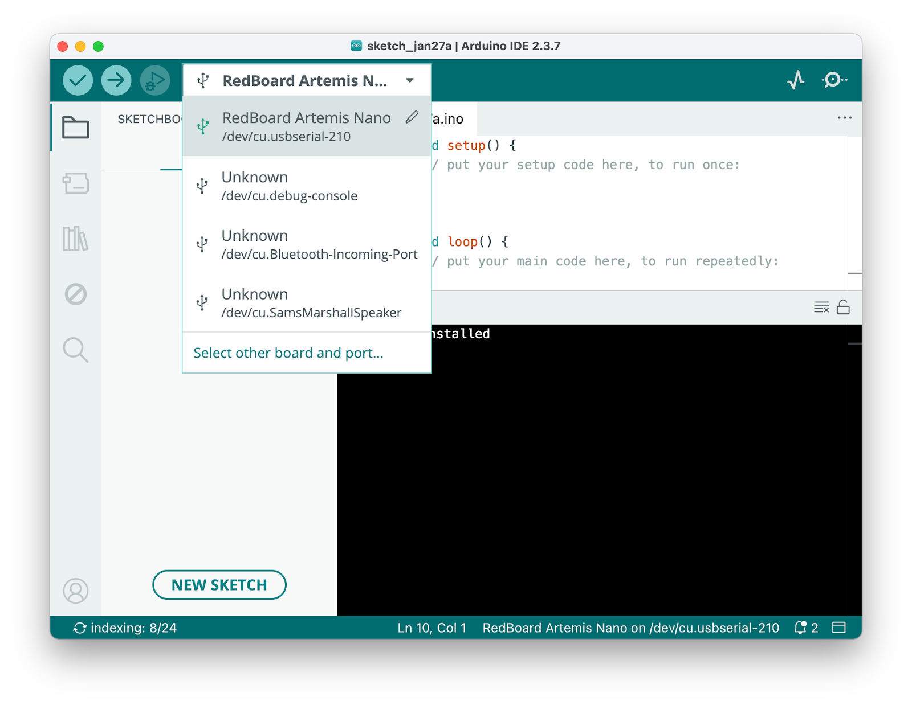

### How BLE Works

The Artemis acts as a BLE peripheral that advertises a service. My computer connects as a central device and sends commands through GATT characteristics. Commands are strings formatted as `<command_type>:<value1>|<value2>`, which the Arduino parses using the `RobotCommand` class.

After compiling and uploading the BLE sketch, the board prints its MAC address:

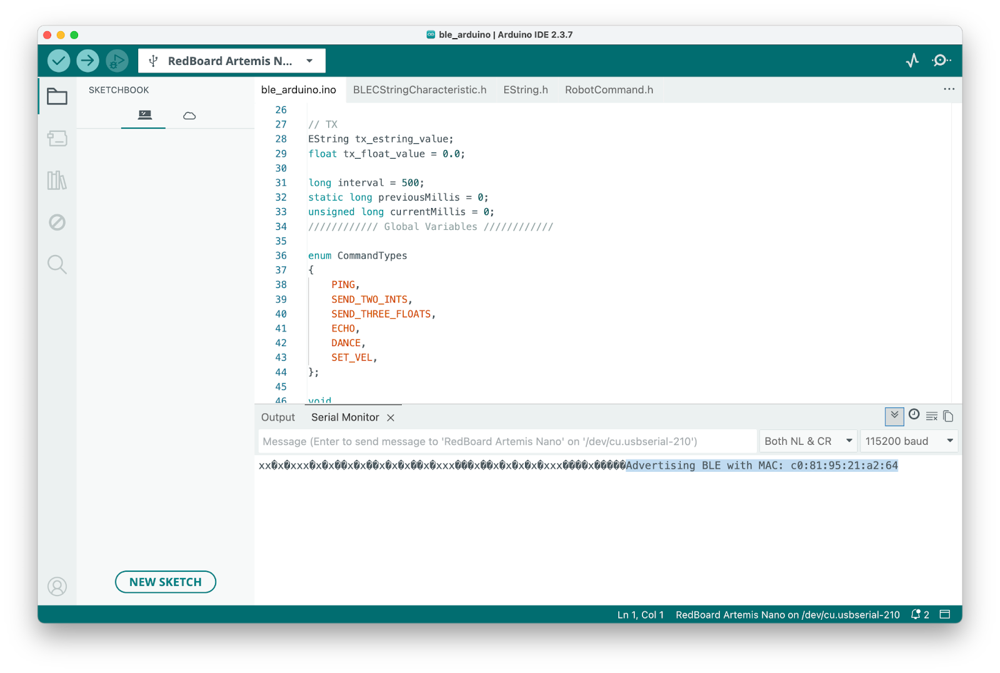

---

## Lab 1A

### Blink

Ran the example from `File > Examples > 01.Basics > Blink`. The LED blinks on and off.

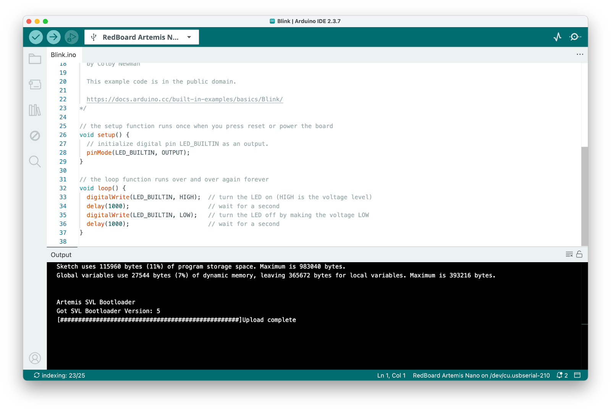

<video width="100%" controls>
  <source src="images/blinking.MOV" type="video/mp4">
</video>

### Serial

Ran `Example4_Serial` from the Apollo3 examples. Typed messages in the serial monitor and they echoed back.

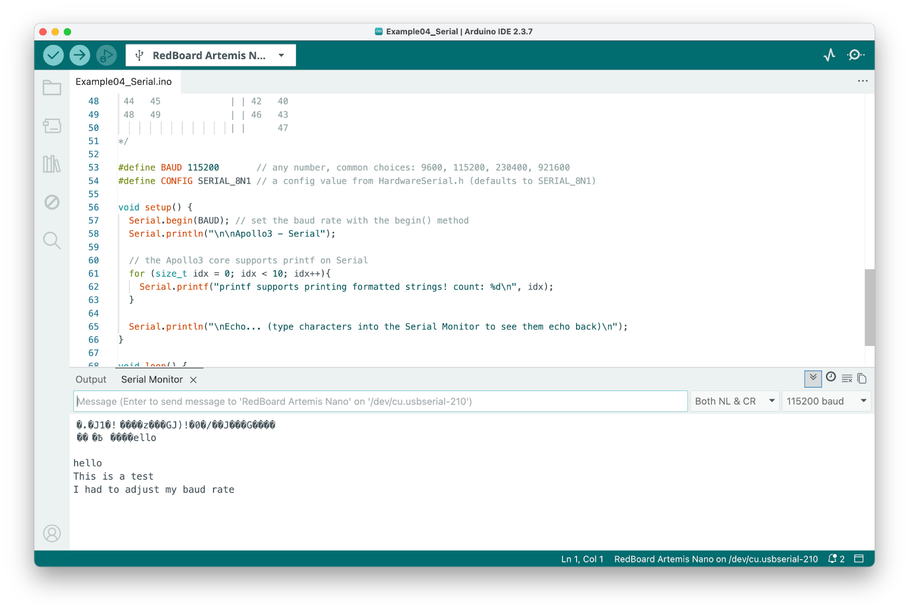

### Temperature Sensor

Ran `Example2_analogRead`. The temperature reading started around 74°F at baseline:

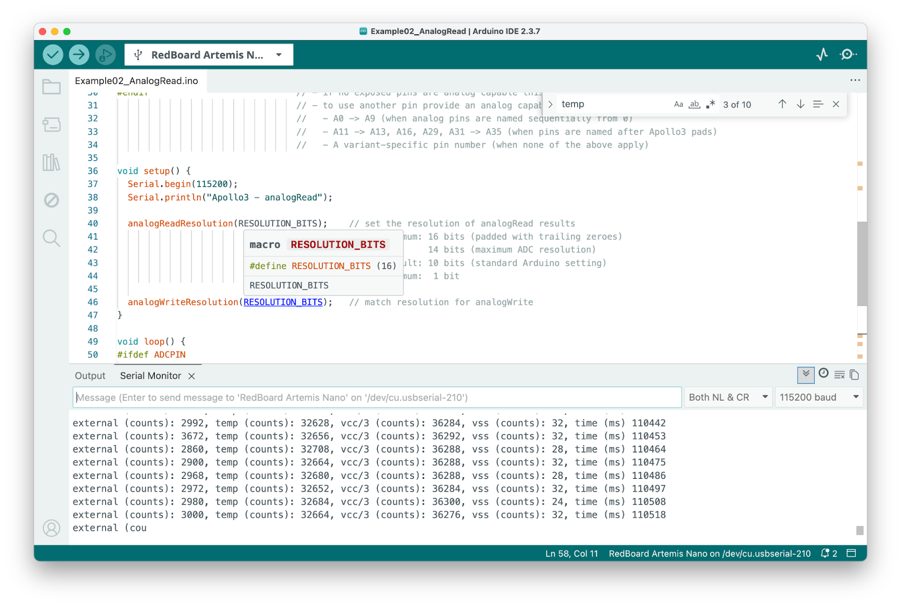

When I touched the chip, the temperature increased:

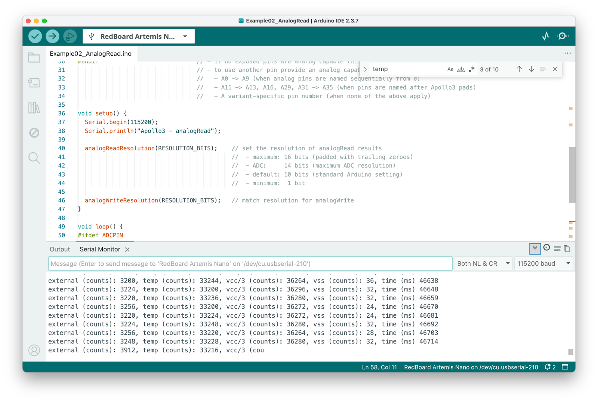

### Microphone

Ran `Example1_MicrophoneOutput` from the PDM examples. Here's the baseline with ambient noise:

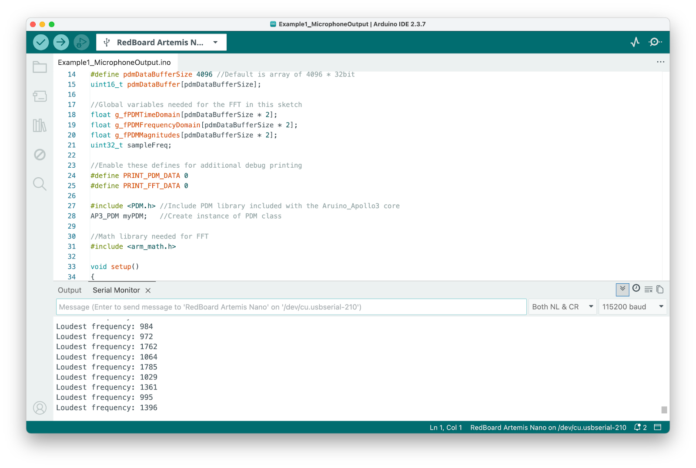

The loudest frequency changed when I made a loud sound (scratching):


---

## Lab 1B

### Configuration

I set my MAC address in `connection.yaml` and connected from Jupyter:

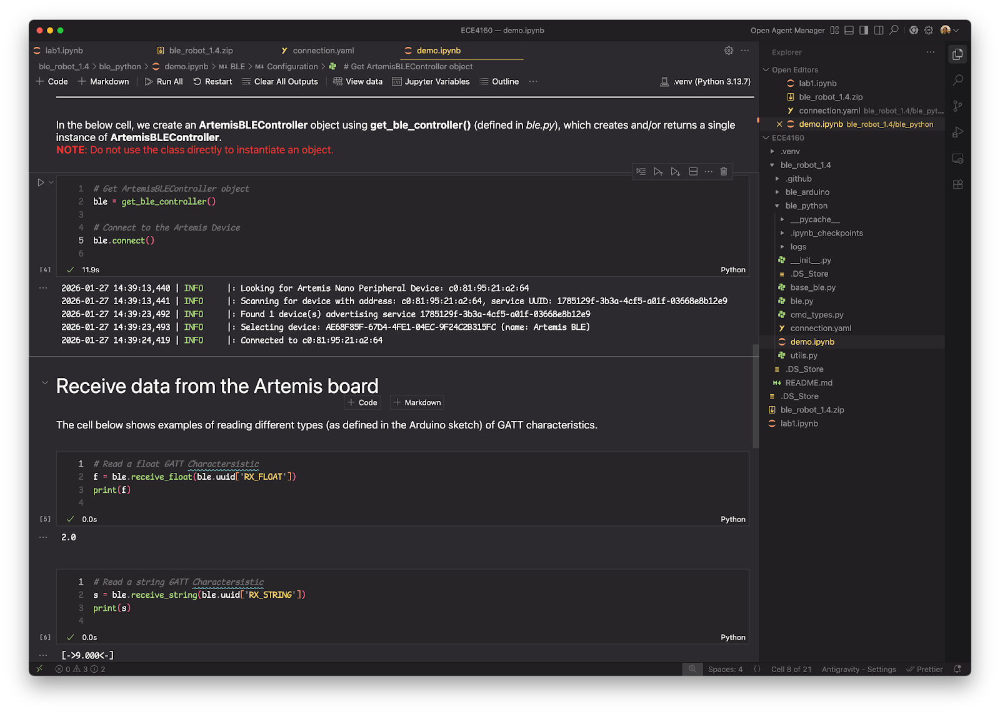

---

### Task 1: ECHO

I implemented the ECHO command to send a string and get an augmented response back.

```cpp
case ECHO:
    char char_arr[MAX_MSG_SIZE];
    success = robot_cmd.get_next_value(char_arr);
    if (!success) return;

    tx_estring_value.clear();
    tx_estring_value.append("Robot Says -> ");
    tx_estring_value.append(char_arr);
    tx_characteristic_string.writeValue(tx_estring_value.c_str());
    break;
```

When I send "HiHello", the Arduino receives it:

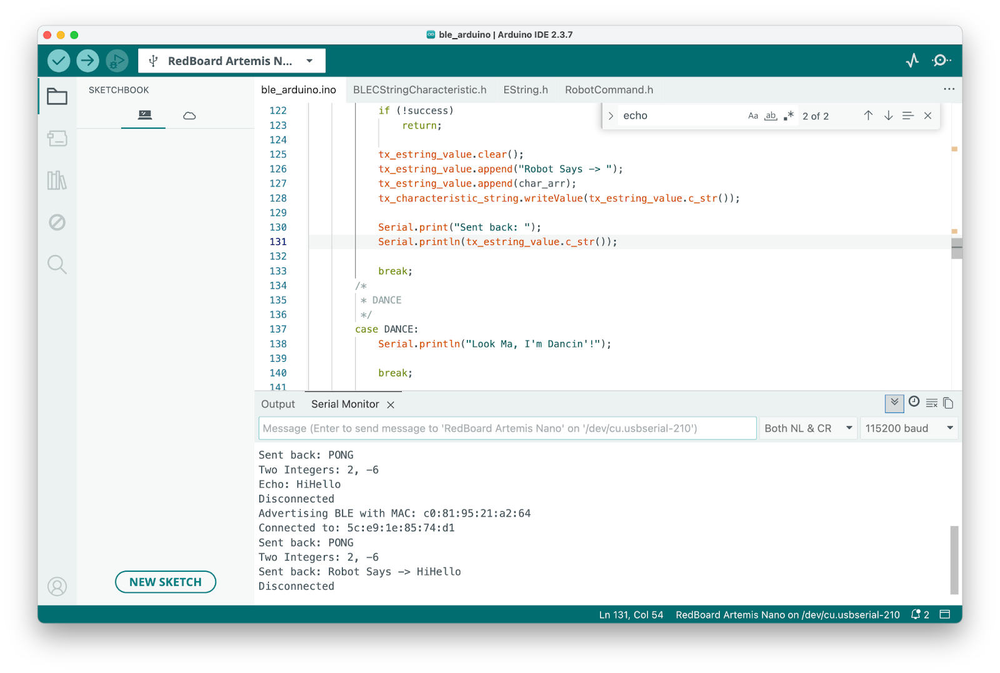

And Python receives the augmented response:

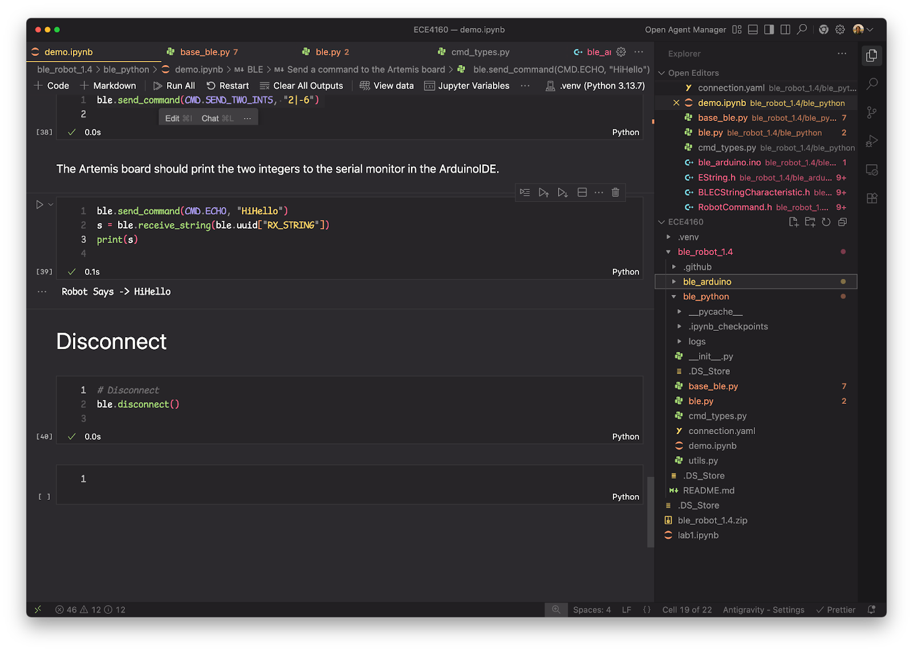

---

### Task 2: SEND_THREE_FLOATS

Added a command to receive three floats. Sent from Python:

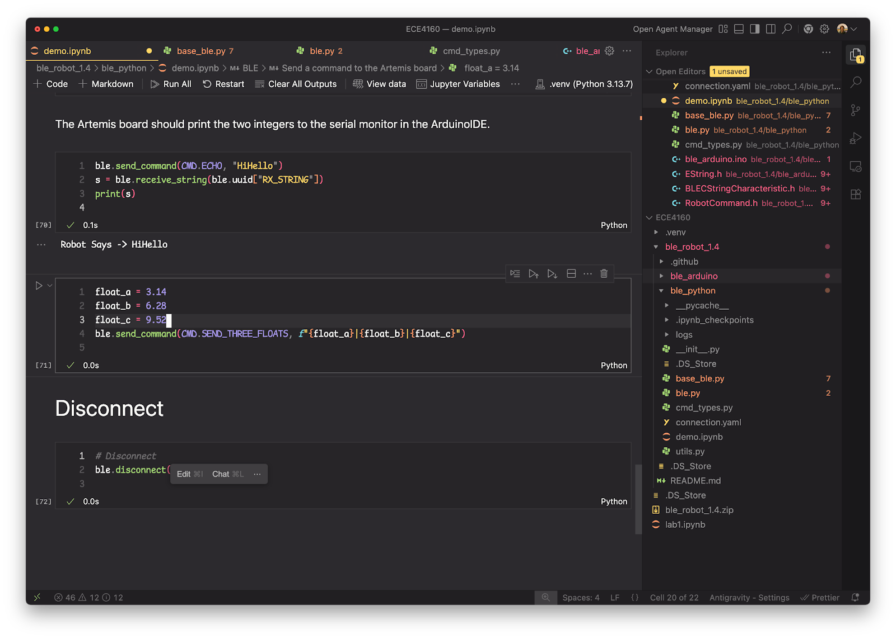

Arduino receives and prints them:

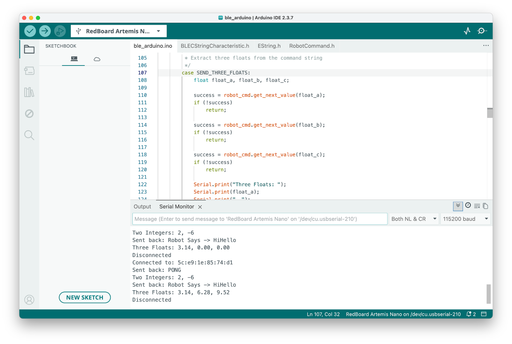

---

### Task 3: GET_TIME_MILLIS

This command returns the current time in milliseconds:

```cpp
case GET_TIME_MILLIS:
    tx_estring_value.clear();
    tx_estring_value.append("T:");
    tx_estring_value.append(millis());
    tx_characteristic_string.writeValue(tx_estring_value.c_str());
    break;
```

Arduino sends the timestamp:

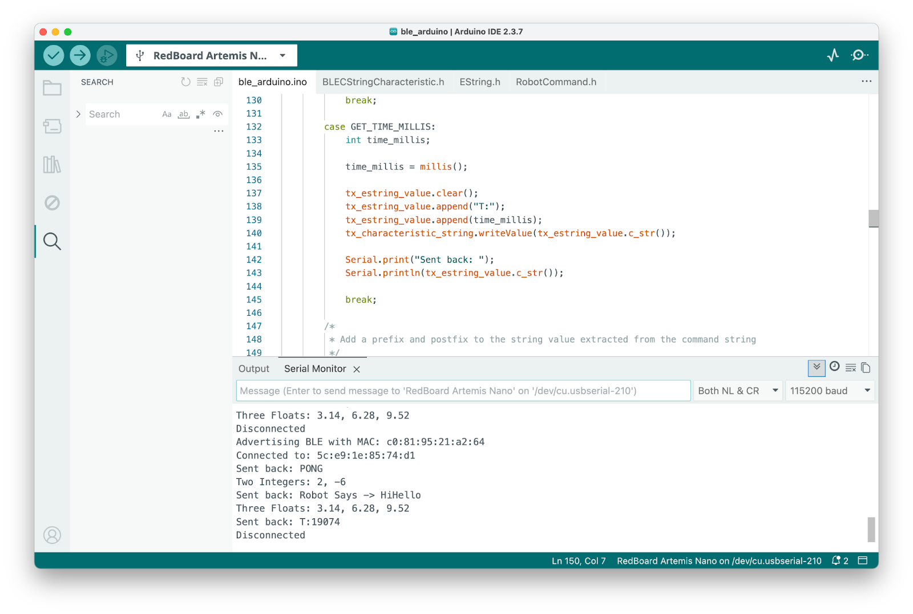

Python receives it:

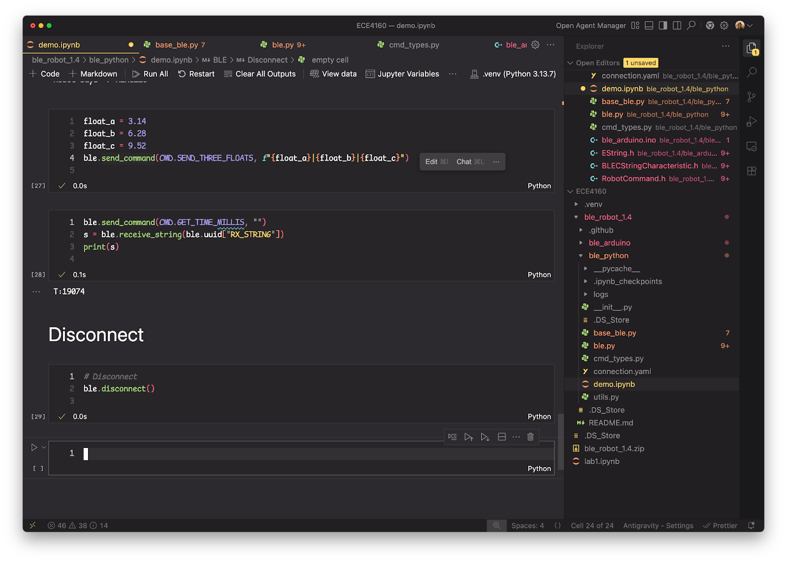

---

### Task 4: Notification Handler

I set up a callback in Python to receive data asynchronously. The handler parses the incoming message to extract the timestamp and temperature:

```python
import numpy as np

times = np.array([])
temps = np.array([])

def handle_time(uuid, message):
    global times, temps

    message_str = message.decode()
    arr = message_str.split("|")
    time_str, temp_str = arr[0], arr[1]
    time = float(time_str.split(":")[1])
    temp = float(temp_str)

    times = np.append(times, time)
    temps = np.append(temps, temp)

ble.start_notify(ble.uuid["RX_STRING"], handle_time)
```

This collects data whenever the Artemis sends a notification.

---

### Task 5: Data Transfer Rate

I sent 100 GET_TIME_MILLIS commands and measured the time between messages. Using the slow method (send immediately):

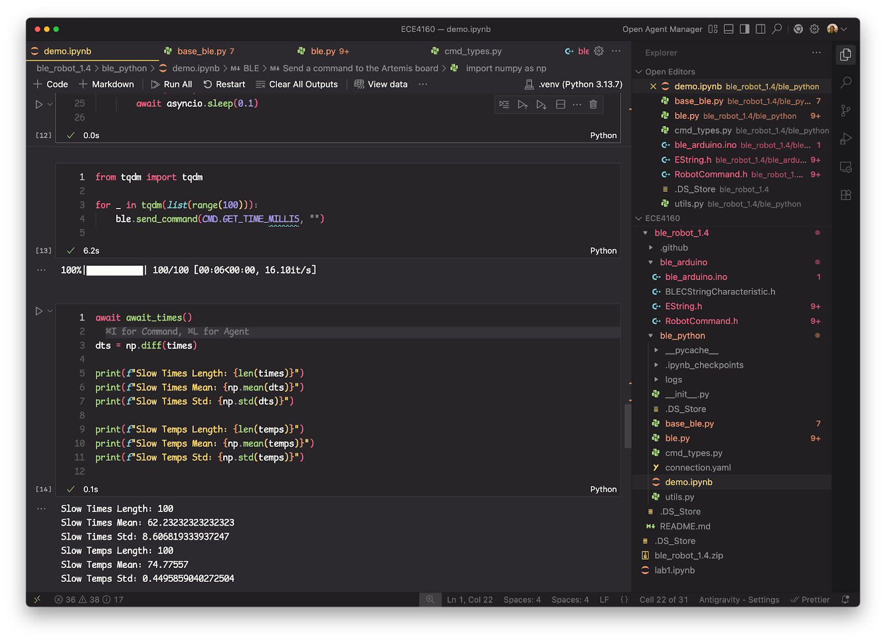

- Mean: 62 ms between messages
- Rate: about 16 messages/second

This is slow because each message requires a full BLE round-trip.

---

### Task 6: Store Time Data

Instead of sending each timestamp immediately, I used a circular buffer to store samples and send them later. This avoids BLE overhead during data collection.

```cpp
#define CIRCULAR_ARR_SIZE (256)
#define CIRCULAR_ARR_MASK (0xff)

int arr_ptr = 0;
int arr_tail = 0;
int time_millis_arr[CIRCULAR_ARR_SIZE];
float temp_arr[CIRCULAR_ARR_SIZE];

void push_time(int time, float temp) {
    time_millis_arr[arr_ptr] = time;
    temp_arr[arr_ptr] = temp;
    arr_ptr = (arr_ptr + 1) & CIRCULAR_ARR_MASK;
    if (arr_ptr == arr_tail) {
        arr_tail = (arr_tail + 1) & CIRCULAR_ARR_MASK;  // overwrite oldest
    }
}

bool get_time(int &time, float &temp) {
    if (arr_tail == arr_ptr) return false;  // empty
    time = time_millis_arr[arr_tail];
    temp = temp_arr[arr_tail];
    arr_tail = (arr_tail + 1) & CIRCULAR_ARR_MASK;
    return true;
}
```

The `STORE_TIME_MILLIS` command takes a count parameter and stores n samples:

```cpp
case STORE_TIME_MILLIS:
    int count;
    robot_cmd.get_next_value(count);
    for (int i = 0; i < count; i++) {
        push_time(millis(), getTempDegF());
    }
    break;
```

---

### Task 7: Temperature with Timestamps

The `SEND_TIME_MILLIS` command reads from the circular buffer and sends all stored data:

```cpp
case SEND_TIME_MILLIS:
    int time_millis;
    float temp;
    while (get_time(time_millis, temp)) {
        tx_estring_value.clear();
        tx_estring_value.append("T:");
        tx_estring_value.append(time_millis);
        tx_estring_value.append("|");
        tx_estring_value.append(temp);
        tx_characteristic_string.writeValue(tx_estring_value.c_str());
    }
    break;
```

From Python, I can store 100 samples and then retrieve them all:

```python
ble.send_command(CMD.STORE_TIME_MILLIS, "100")
ble.send_command(CMD.SEND_TIME_MILLIS, "")
```

Results with the fast method:

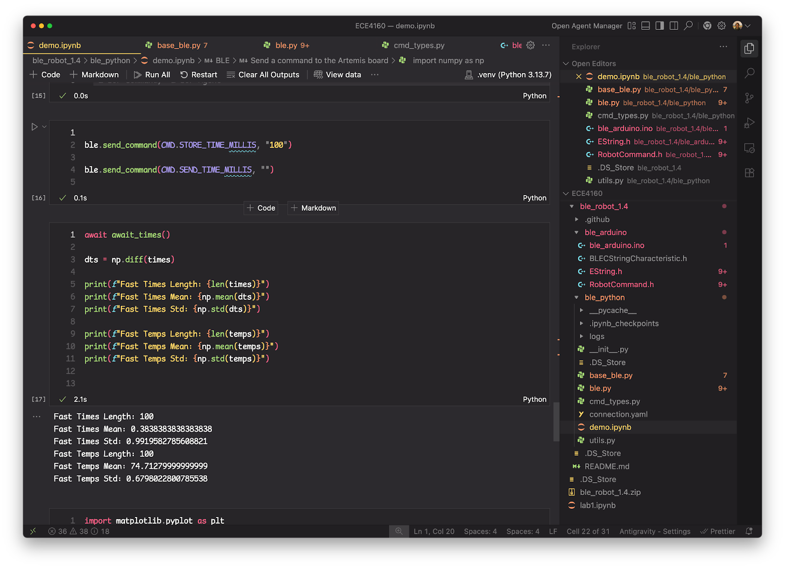

- Mean time between samples: 0.38 ms
- About 2600 samples/second

---

### Discussion

Sending each reading immediately works well for real-time monitoring but is slow at around 16 Hz. Storing samples first and sending them later gives much faster data capture at around 2600 Hz, but you don't see the data until after collection and you're limited by memory.

The Artemis has 384 kB of RAM. Each sample uses 8 bytes (4 for time, 4 for temp), so you can fit about 48,000 samples. At 0.38 ms per sample, that's roughly 18 seconds of continuous data.

---

## Conclusion

I got the Artemis board working with BLE and can now send commands and receive data wirelessly. The main tradeoff is between real-time data (slow) and batch recording (fast but delayed).
