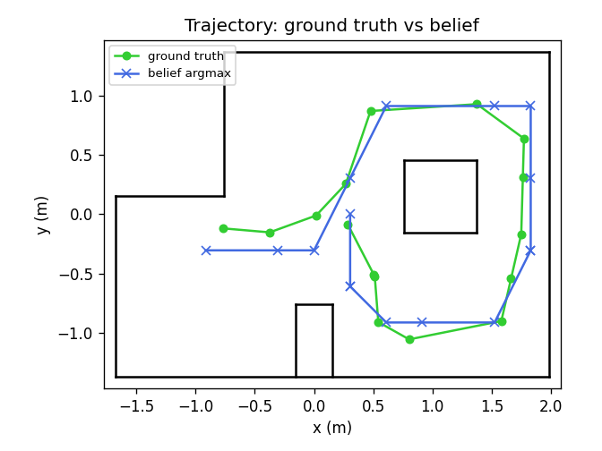
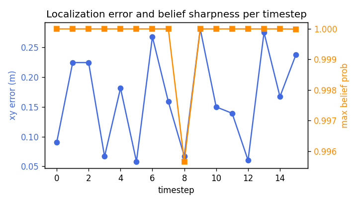
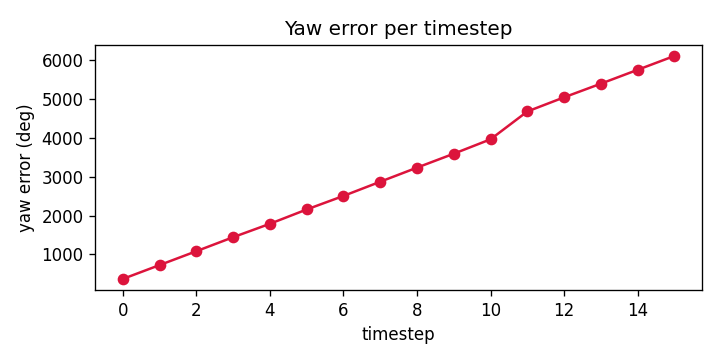
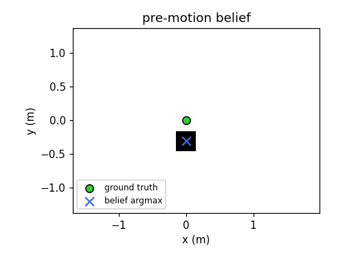
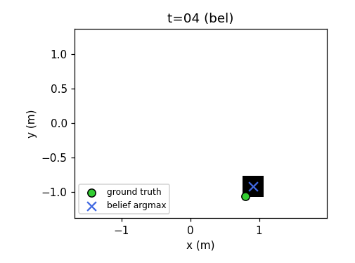
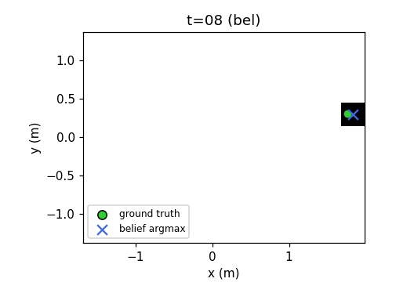
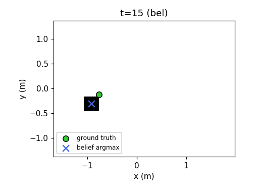

# Lab 10: Localization (sim)

## Introduction

Grid localization represents the robot pose as a probability distribution over a 12 × 9 × 18 grid. The Bayes filter maintains `bel_bar` after a prediction step that folds in odometry, and `bel` after an update step that folds in an eighteen ray panoramic scan. I implemented the filter against the provided simulator and ran it across the sixteen step trajectory.

## Bayes Filter Implementation

The odometry motion model factors the pose change into a first rotation, a translation, and a second rotation. Both rotations pass through `mapper.normalize_angle`, so a heading change from 350 to -10 degrees is treated as a twenty degree rotation.

```python
def compute_control(cur_pose, prev_pose):
    delta_x = cur_pose[0] - prev_pose[0]
    delta_y = cur_pose[1] - prev_pose[1]
    delta_trans = math.hypot(delta_x, delta_y)
    delta_rot_1 = mapper.normalize_angle(
        math.degrees(math.atan2(delta_y, delta_x)) - prev_pose[2]
    )
    delta_rot_2 = mapper.normalize_angle(cur_pose[2] - prev_pose[2] - delta_rot_1)
    return delta_rot_1, delta_trans, delta_rot_2
```

The three control components are treated as independent Gaussian random variables, so the joint probability factors into the product of three scalar Gaussians on the signed error between hypothesized and measured control.

```python
def odom_motion_model(cur_pose, prev_pose, u):
    actual_rot_1, actual_trans, actual_rot_2 = compute_control(cur_pose, prev_pose)
    rot_error_1 = mapper.normalize_angle(actual_rot_1 - u[0])
    trans_error = actual_trans - u[1]
    rot_error_2 = mapper.normalize_angle(actual_rot_2 - u[2])
    return (
        loc.gaussian(rot_error_1, 0.0, loc.odom_rot_sigma)
        * loc.gaussian(trans_error, 0.0, loc.odom_trans_sigma)
        * loc.gaussian(rot_error_2, 0.0, loc.odom_rot_sigma)
    )
```

A direct prediction step is a double loop over 1944 previous cells and 1944 current cells, which is 3.7 million motion model evaluations per step. Because the update step collapses the belief onto a single cell on most iterations, I limit the outer loop with a threshold of 1e-4. In this trajectory the outer loop runs once per step everywhere except t=9, where two cells clear the threshold.

```python
def prediction_step(cur_odom, prev_odom):
    control = compute_control(cur_odom, prev_odom)
    loc.bel_bar = np.zeros_like(loc.bel_bar)
    previous_indices = np.argwhere(loc.bel >= 1e-4)

    for prev_x, prev_y, prev_a in previous_indices:
        prior = loc.bel[prev_x, prev_y, prev_a]
        prev_pose = mapper.from_map(prev_x, prev_y, prev_a)
        for cur_x in range(mapper.MAX_CELLS_X):
            for cur_y in range(mapper.MAX_CELLS_Y):
                for cur_a in range(mapper.MAX_CELLS_A):
                    cur_pose = mapper.from_map(cur_x, cur_y, cur_a)
                    loc.bel_bar[cur_x, cur_y, cur_a] += (
                        odom_motion_model(cur_pose, prev_pose, control) * prior
                    )

    loc.bel_bar /= np.sum(loc.bel_bar)
```

The update step is fully vectorized against `mapper.obs_views` of shape (12, 9, 18, 18), which holds the eighteen precached ray ranges for each cell. The Gaussian broadcasts across every cell, and a product along the ray axis collapses the tensor to a per cell scalar likelihood.

```python
def update_step():
    measurement = loc.obs_range_data.reshape(-1)
    likelihoods = loc.gaussian(measurement, mapper.obs_views, loc.sensor_sigma)
    loc.bel = np.prod(likelihoods, axis=-1) * loc.bel_bar
    loc.bel /= np.sum(loc.bel)
```

## Results

Across the sixteen step trajectory the belief argmax tracked ground truth to within a single cell diagonal on every step. Mean xy error was 0.165 meters, maximum 0.281 meters at t=9, and minimum 0.058 meters at t=5. The posterior concentrated onto a single cell on fourteen of sixteen steps, with a mean maximum belief probability of 0.9997 and a minimum of 0.996 at t=8.

### Trajectory run

<video controls width="100%">
  <source src="images/video.mp4" type="video/mp4">
</video>

Green is ground truth, red is odometry, and blue is the belief argmax. The spin between waypoints is the observation sweep that gathers the eighteen range measurements.

### Trajectory overlay and error







### Per step statistics

All poses are in (meters, meters, degrees). The full log, with yaw error and cell indices, is in [localization_stats.csv](images/localization_stats.csv).

| t   | belief (x, y, yaw)     | prob  | ground truth (x, y, yaw) | xy err (m) |
| --- | ---------------------- | ----- | ------------------------ | ---------- |
| 0   | (0.305, 0.000, -50)    | 1.000 | (0.287, -0.089, -39)     | 0.091      |
| 1   | (0.305, -0.610, -70)   | 1.000 | (0.505, -0.511, 297)     | 0.224      |
| 2   | (0.305, -0.610, -90)   | 1.000 | (0.513, -0.525, 635)     | 0.224      |
| 3   | (0.610, -0.914, -90)   | 1.000 | (0.542, -0.911, 994)     | 0.067      |
| 4   | (0.914, -0.914, 10)    | 1.000 | (0.803, -1.057, 1440)    | 0.181      |
| 5   | (1.524, -0.914, 50)    | 1.000 | (1.581, -0.902, 1848)    | 0.058      |
| 6   | (1.829, -0.305, 90)    | 1.000 | (1.663, -0.545, 2237)    | 0.267      |
| 7   | (1.829, -0.305, 90)    | 1.000 | (1.749, -0.168, 2603)    | 0.159      |
| 8   | (1.829, 0.305, 110)    | 0.996 | (1.762, 0.315, 2985)     | 0.067      |
| 9   | (1.829, 0.914, 150)    | 1.000 | (1.772, 0.640, 3384)     | 0.281      |
| 10  | (1.524, 0.914, 150)    | 1.000 | (1.375, 0.930, 3754)     | 0.150      |
| 11  | (0.610, 0.914, -110)   | 1.000 | (0.477, 0.873, 4208)     | 0.139      |
| 12  | (0.305, 0.305, -70)    | 1.000 | (0.268, 0.257, 4616)     | 0.060      |
| 13  | (0.000, -0.305, -130)  | 1.000 | (0.018, -0.011, 4907)    | 0.275      |
| 14  | (-0.305, -0.305, -150) | 1.000 | (-0.374, -0.153, 5244)   | 0.167      |
| 15  | (-0.914, -0.305, -170) | 1.000 | (-0.766, -0.119, 5581)   | 0.237      |

The simulator reports yaw unwrapped, so raw values accumulate past 360 degrees. Reducing them modulo 360 yields a yaw aligned with the belief within a single bin on every step.

### Belief heatmaps

Each image sums the belief over the yaw axis. Green marks ground truth, and blue marks the belief argmax.

<table>
<tr>
<td></td>
<td></td>
</tr>
<tr>
<td></td>
<td></td>
</tr>
</table>

## Discussion

The filter tracks ground truth because the eighteen ray observation is highly discriminative at almost every pose. Where features are dense, the per cell likelihood product collapses onto a single cell and the 1e-4 prior gate makes the next prediction step essentially free. Near long straight walls two cells can share similar ranges along several rays, the posterior is less peaky, and this is the story at t=8 where the maximum belief probability bottomed out at 0.996.

The yaw axis is coarse at twenty degrees per cell, and when the true yaw sits near a boundary the argmax flips between adjacent cells at similar posterior mass, which produces the jumps in the yaw error plot. Odometry alone drifts roughly a meter off ground truth over sixteen steps, and the correction is driven entirely by the sensor model.

The failure mode I can anticipate is an ambiguous observation arriving while the prior has already diffused, which would let a spurious mode survive a step. The sparsity gate only removes low prior cells and does not guard against this. This trajectory does not exercise the failure, but a longer path through featureless corridors would.
