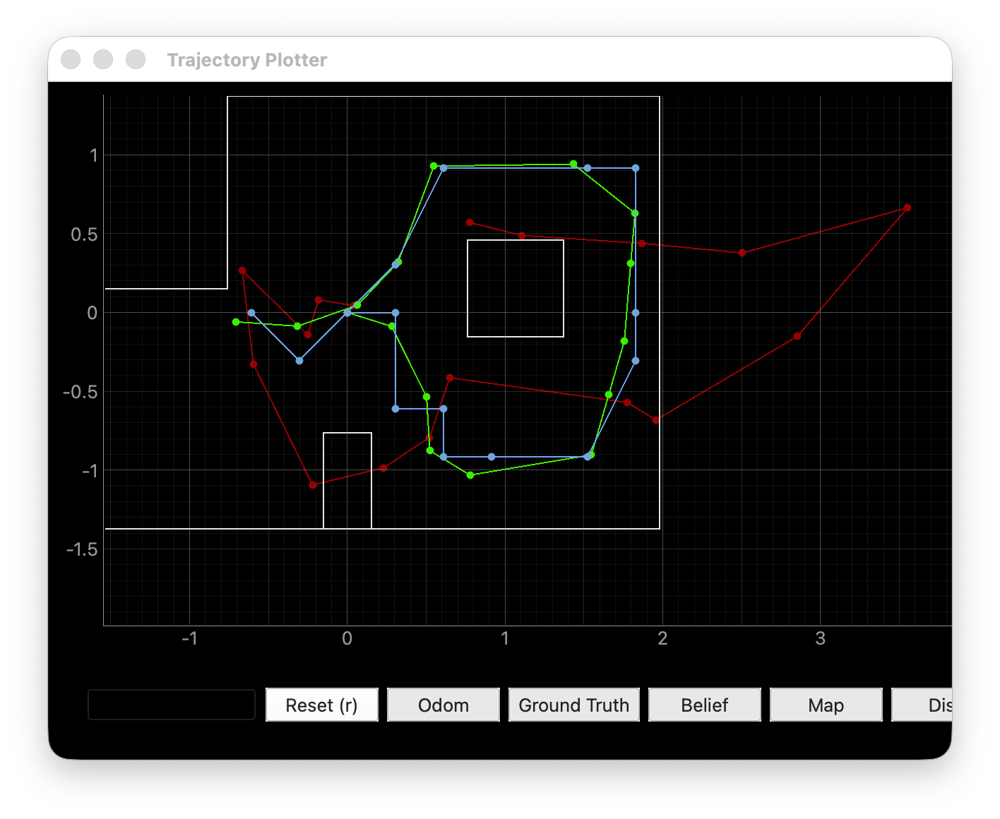
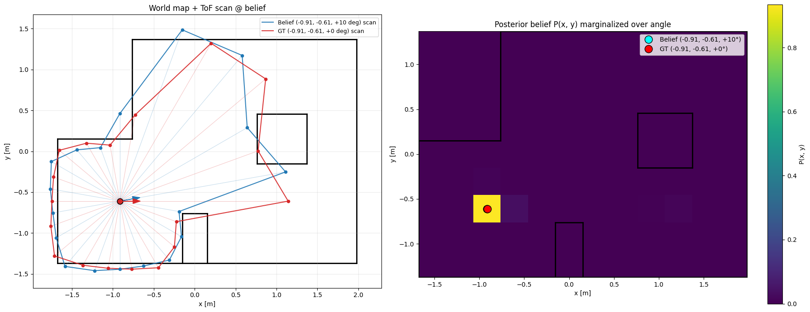
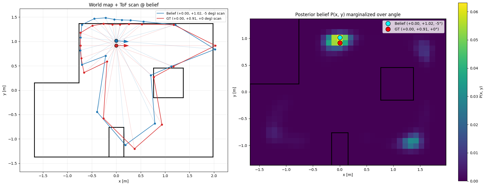
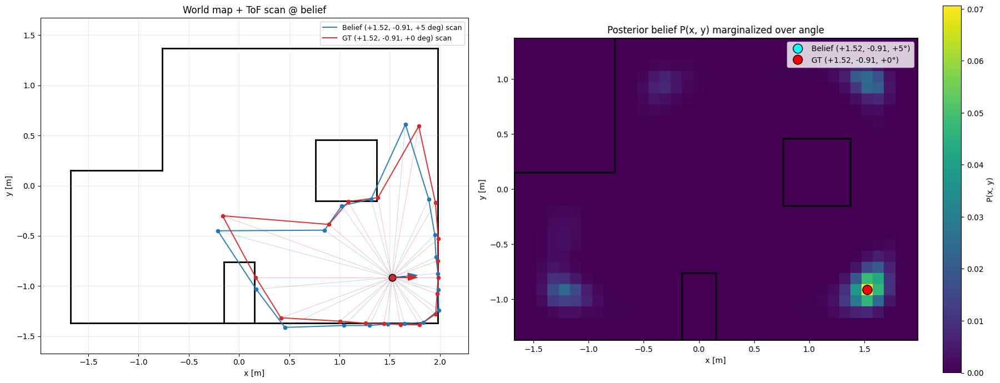
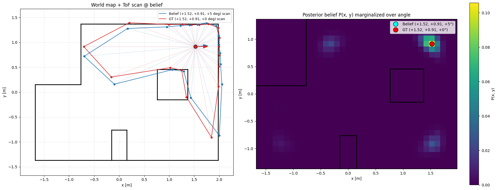

# Lab 11: Localization (real)

## Introduction

Lab 11 ports the grid Bayes filter from Lab 10 onto the physical Artemis robot. Only the update step runs, because wheel odometry on this platform is too noisy to inform the prediction step. The robot performs an in place 360 degree sweep, samples its two ToF sensors at 18 angles spaced 20 degrees apart, and sends the range vector to the computer. The computer runs a single update step against the precached ray map and reports the posterior at four marked poses on the lab floor.

## Simulation

The provided simulator notebook runs the full filter against the virtual robot. The final plot shows odom, ground truth, and belief over a known trajectory.



## Observation Loop

The binary packet command structure from an earlier lab handled the data transfer. Each BLE command is a typed dataclass with its own response type, so `perform_observation_loop` is three calls: `MapStart` to start the sweep, `MapStatus` polled until it returns false, and `SendMapData` which returns a list of (angle, distance) buckets ready to sort and reshape into the column vector the filter expects. `BaseLocalization.get_observation_data` was promoted to `async` so the coroutine can be awaited end to end.

```python
async def perform_observation_loop(self, rot_vel=120):
    await self.ble.execute(MapStart(num_steps=18))
    while await self.ble.execute(MapStatus()):
        await asyncio.sleep(0.5)

    buckets = await self.ble.execute(SendMapData())
    buckets.sort(key=lambda b: b.index)
    ranges_m = np.array([b.distance / 1000.0 for b in buckets])
    return ranges_m[np.newaxis].T, np.array([])
```

On the firmware side, the changes from prior labs were a per sensor radial offset to convert lens distance into robot frame distance, and zeroing the motors during the sample window so the chassis is static while ToF rays are collected.

## Results

Three of the four poses land on the correct cell with zero xy error. The interior pose (0, 3) is one cell off in y. Reported yaw is off by 5 to 10 degrees at every pose, which matches the placement error on the tile.

After pose 1 I tripled the grid resolution along x and y to produce finer heatmaps. The same posterior mass is spread across 9x more cells, so the reported probability at the argmax dropped by 9x for poses 2 through 4. The drop is a binning artifact, not a degradation of the filter.

### Pose 1: (-3 ft, -2 ft, 0 deg)



Argmax (-0.91, -0.61), prob 0.95, xy error 0.00 m. The pose sits in the lower left pocket bounded by two perpendicular walls. The posterior collapses onto a single cell, and the belief scan tracks the room outline along the left and bottom walls.

### Pose 2: (0 ft, 3 ft, 0 deg)



Argmax (0.00, 1.02), prob 0.06, xy error 0.11 m. One cell north of ground truth. The pose has one nearby wall, so several neighboring cells produce a similar range vector and the filter cannot pick a single peak.

### Pose 3: (5 ft, -3 ft, 0 deg)



Argmax (1.52, -0.91), prob 0.07, xy error 0.00 m. Two perpendicular walls plus the central column give a unique range pattern.

### Pose 4: (5 ft, 3 ft, 0 deg)



Argmax (1.52, 0.91), prob 0.10, xy error 0.00 m. Symmetric to pose 3.

### Per pose statistics

| pose        | belief (x, y, yaw)  | prob   | ground truth (x, y, yaw) | xy err (m) |
| ----------- | ------------------- | ------ | ------------------------ | ---------- |
| (-3, -2, 0) | (-0.91, -0.61, +10) | 0.95   | (-0.914, -0.610, 0)      | 0.00       |
| (0, 3, 0)   | (0.00, +1.02, -5)   | 0.06\* | (0.000, 0.914, 0)        | 0.11       |
| (5, -3, 0)  | (+1.52, -0.91, +5)  | 0.07\* | (1.524, -0.914, 0)       | 0.00       |
| (5, 3, 0)   | (+1.52, +0.91, +5)  | 0.10\* | (1.524, 0.914, 0)        | 0.00       |

\* Measured after the 3x3 grid refinement, so the same posterior mass is split across 9x more cells. The lower probability is a binning artifact, not a weaker fit.

### Sweep video

One full 18 step sweep at pose 2.

<video controls width="100%">
  <source src="images/pose_2_scan_video.mp4" type="video/mp4">
</video>

## Discussion

Three of the four poses land on the correct cell and the fourth is one cell off.

The three corner poses localized to a single cell. Pose 1 produced the tightest posterior. Each corner pose has at least two perpendicular walls within sensor range, and those walls produce a range vector that no other cell can reproduce. The interior pose (0, 3) had one nearby wall and open space in front, so the range vector matched several cells within sensor noise.

The largest source of error was the ToF sensors pitched down on the chassis. When a sensor tilts down, the beam hits the floor before it reaches the wall and the reading comes back too short. This appears as truncated endpoints in the pose 1 scan overlay and as the secondary mass in the pose 2 and pose 3 heatmaps. The secondary peaks land on other corners of the room, which share the same perpendicular wall geometry and produce similar range vectors.

Compared to the Lab 10 simulator, the real posteriors are less concentrated. The simulator collapsed onto a single cell at every step because the synthetic range vector was clean. The filter responds to real measurements as designed: sharp where the geometry is informative, broad where it is not.
