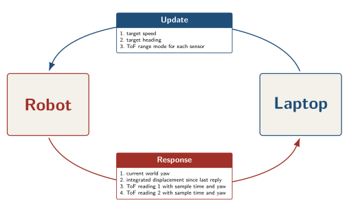
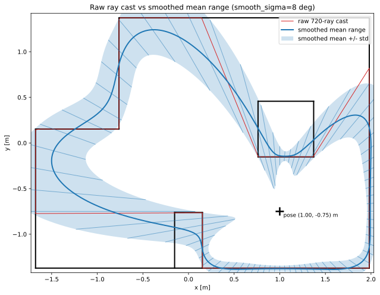
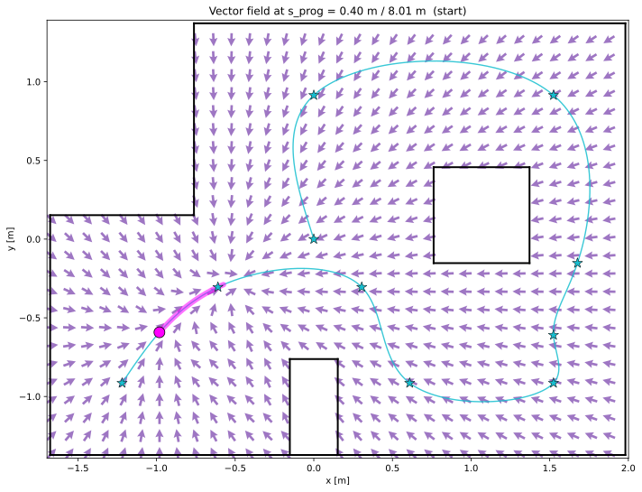
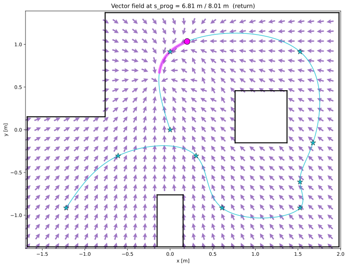

# Lab 12: Planning and Execution

## Introduction

The final lab ties together everything from labs 1 through 11. The robot drives a through a list of waypoints on the field while a Bayes filter tracks the liklihood of its position, while a path planner generates the commands for the robot to follow. The laptop runs the filter and the controller, and the robot runs a simple loop that receives BLE commands from the laptop and runs a heading PID while reporting back the latest ToF readings. There is no need for a full 360° scan.

## Final Run

<video controls autoplay muted loop playsinline width="100%">
  <source src="images/RobotMovingAroundCourseFaster.mp4" type="video/mp4">
</video>

A slower run with the simpler point and drive baseline is included further down for comparison.

## Communication Protocol

Every control tick is one BLE round trip. The host sends a `DriveUpdate(target_speed, target_heading, long_mode_1, long_mode_2)`. The first two arguments drive the heading PID; the last two select the range mode of each ToF sensor for the next sample. The host estimates the expected distance for each sensor: switch to LONG when the predicted range crosses the upper threshold, drop to SHORT only when it falls below the lower threshold. Letting the host pick the mode keeps the firmware free of any guessing about the world. The robot applies the heading PID, samples its sensors in whatever modes were just commanded, and answers with the world yaw, the integrated PWM seconds displacement since the previous reply, and the two most recent ToF readings. Each ToF reading carries its own timestamp and the yaw at sample time, so the host can fold rays that the robot sampled mid turn at the correct world bearing instead of the bearing at reply time.



```python
@dataclass
class DriveUpdate(BLECommand[DriveUpdateResponse]):
    target_speed: float    # PWM units, [-255, 255]
    target_heading: float  # absolute yaw in degrees
    long_mode_1: bool = True  # ToF sensor 1 distance mode
    long_mode_2: bool = True  # ToF sensor 2 distance mode
```

```python
class DriveUpdateResponse(NamedTuple):
    current_us: int
    tof1_time_us: int
    tof1_dist_mm: int
    tof1_yaw_deg: float
    tof2_time_us: int
    tof2_dist_mm: int
    tof2_yaw_deg: float
    yaw_deg: float
    dx_pwm_s: float   # integrated PWM*s, world x
    dy_pwm_s: float   # integrated PWM*s, world y
    abs_pwm_s: float  # integral(|forward|*dt), for noise scaling
```

`dx_pwm_s` and `dy_pwm_s` are integrated on the robot in world frame using the live yaw, so the host gets a directional displacement that has already been weighted by every IMU tick since the last reply. The host multiplies by `pwm_to_vel_mm_s` to get meters and feeds it straight into `predict_displacement`. The sensor update only fires when a ToF timestamp has advanced, so a cached reading is never folded in twice.

One tick of the host loop fits in a few lines:

```python
async def step_once(robot, loc, controller):
    raw_x, raw_y = loc.mean_xy()
    x, y = controller.filtered(raw_x, raw_y)
    speed, target_dir = controller.command(x, y)
    resp = await robot.update(target_speed=speed, target_heading=target_dir, ...)
    filter_step(loc, resp)
    return resp
```

The same `step_once` runs against `SimRobot` and `RealRobot`. The simulator notebook and the real robot notebook share every line of planner, filter, and protocol code.

## Ray Cast Model

The Bayes update reads from a per cell ray cache built once at startup. For every grid cell the cache stores a smoothed mean range and a per bearing standard deviation.

The blur is also physically justified. The VL53L1X is not a straight ray; it has a finite cone of view of around 27 degrees, so the reported distance is closer to the nearest hit anywhere inside that cone than to a single ideal ray. A geometric raycast at one bearing therefore underrepresents the real measurement. Convolving the geometric ranges with a Gaussian along the angular axis approximates the same averaging that the sensor optics already perform, so the cached mean is a better match to what the firmware actually returns.

The std falls out of the same blur for free, using the textbook identity for variance,

$$\operatorname{var}(x) = \mathbb{E}\left[x^2\right] - \mathbb{E}[x]^2,$$

where the expectation $\mathbb{E}$ is replaced by the same circular Gaussian blur along the angular axis. Smoothing the raw ranges gives the local mean, smoothing the squared raw ranges gives the local mean square, and subtracting the squared mean from the mean square gives a local estimate of how much the range varies inside the sensor's cone. Bearings that look at a flat wall give a tight neighborhood and a small variance; bearings that graze a corner give a neighborhood that straddles two surfaces and a large variance.

The raw cast at one pose is dense and discontinuous at corners. The smoothed mean trails a softer version of the room outline.



The red outline is the raw ray cast. The blue band is the smoothed mean plus or minus one std. Bearings that look straight at a wall produce a tight band; bearings that graze a corner or the leading edge of the central obstacle produce a wide band, because rays a few degrees apart hit very different things. The update step standardizes `(measured - mean) / std` and squares it, so a single ToF reading that lands on a corner is weighted by a number that is already several times smaller than a reading that lands on flat wall.

## Baseline: Point and Drive

The first controller was quite simple. `WaypointController.command` reads the belief mean, aims at the next waypoint, and drives forward until the robot is inside a stop radius, then advances to the next waypoint. Speed is mostly a function of angle error, but from the laptop's perspective is constant.

```python
def command(self, x, y):
    while not self.done:
        wx, wy = self.path[self.idx]
        dx, dy = wx - x, wy - y
        dist_mm = math.hypot(dx, dy) * 1000.0
        if dist_mm < self.stop_radius_mm:
            self.idx += 1
            continue
        speed = 50.0
        return speed, math.degrees(math.atan2(dy, dx))
    return 0.0, 0.0
```

<video controls autoplay muted loop playsinline width="100%">
  <source src="images/RobotMovingAroundCourse.mp4" type="video/mp4">
</video>

This is the baseline. It works, but the trajectory has sharp turns at each waypoint and the robot loses time around sharp corners where the Angle PID controller is uncontrolled.

## Final: Belief Weighted Vector Field

The final controller fits a cubic spline through the waypoints and precomputes, for every valid grid cell, two heading vectors. Each vector is an average of the spline tangent heading at the nearest point and the unit vector pointing from the cell toward that spline point. When close to the path it sticks to the tangent; when far from the path it points back toward the path. The parts of the path which are valid to point to change as the robot advances, so that it doesn't try to skip any part of the path.

<div style="display:flex;gap:0.5em;flex-wrap:wrap">
  
  
</div>

Since every visible cell has a heading vector, the controller can take the liklihood that the robot is in each cell and average the heading vectors together to get a single best guess for which way to point. The more these headings conflict, the more smaller the vector will be, which will make it slower. If every part of the field tells it to move the same way, the faster it will go.

```python
def command(self, x, y):
    bel = self.loc.bel
    ps = self._pass_s
    eligible = (
        self._visible
        & (ps >= self.s_prog)
        & (ps <= self.s_prog + self.advance_window_m)
    )
    weight = bel[..., None] * self._kernel * eligible
    W = float(weight.sum())
    head_x = (weight * self._heading_vec[..., 0]).sum() / W
    head_y = (weight * self._heading_vec[..., 1]).sum() / W
    coherence = min(1.0, math.hypot(head_x, head_y))
    target_dir = math.degrees(math.atan2(head_y, head_x))
    return self.drive_pwm * coherence, target_dir
```

<video controls autoplay muted loop playsinline width="100%">
  <source src="images/RobotMovingAroundCourseFaster.mp4" type="video/mp4">
</video>

## Discussion

What worked. Pushing the integration of odometry onto the robot collapses two BLE messages into one, and lets the prediction step use a direction that was averaged across every IMU tick rather than a single sampled yaw. Tagging each ToF reading with its own timestamp and yaw lets the host fold rays sampled mid turn at the bearing they were actually sampled at, not the bearing at reply time. The variance baked into the ray cache allows the system to be robust to corners or hard to sense areas of the field. The coherence based speed scaling removes the need for any explicit slowdown logic at corners.

What did not work as well. In long mode, the ToF sensors respond slower, so it's necessary to switch into short mode when possible. The other ceiling is BLE round trip time. The controller runs at BLE rate, around ~10 Hz, and the heading PID on the robot runs much faster underneath, so the practical speed limit is set by how often the host can re-aim.
