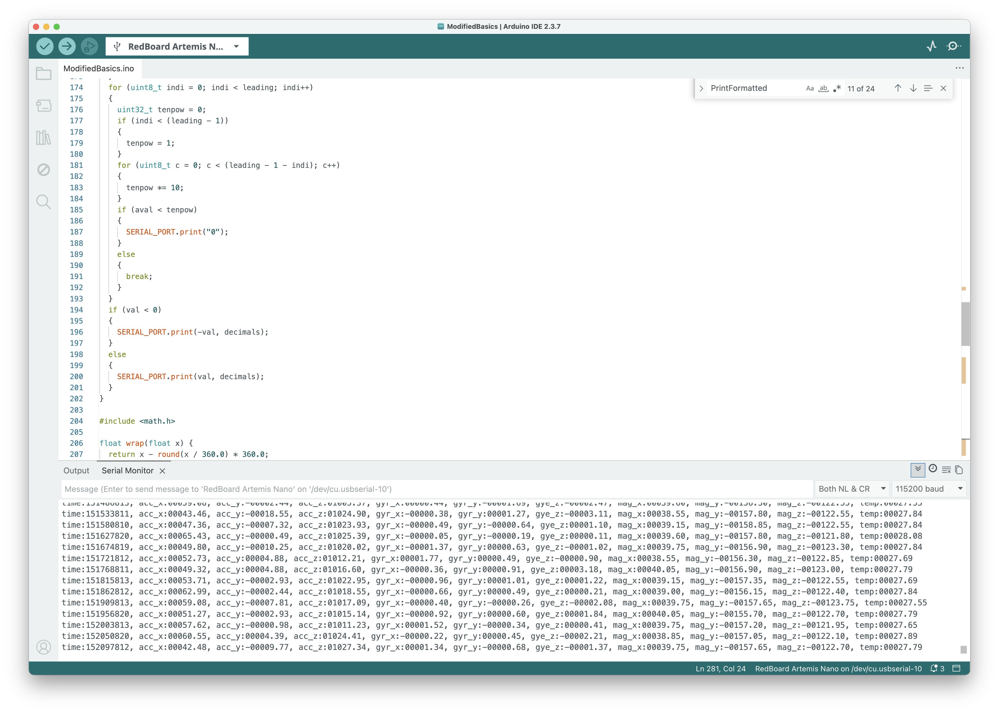
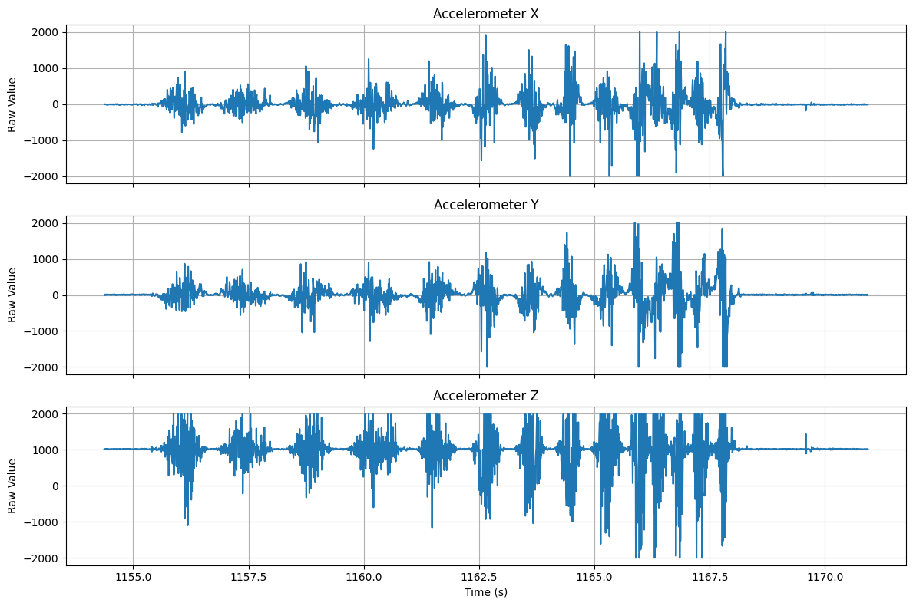
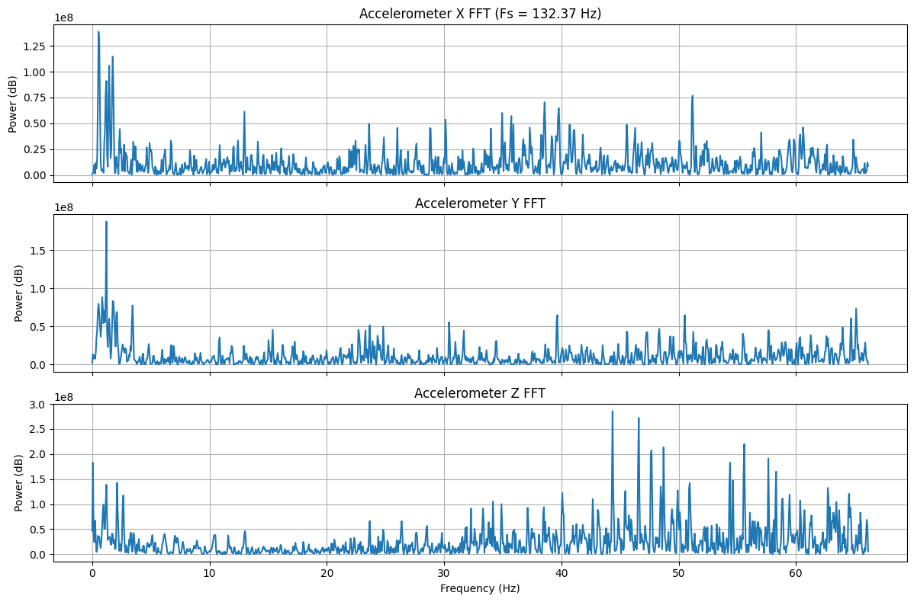
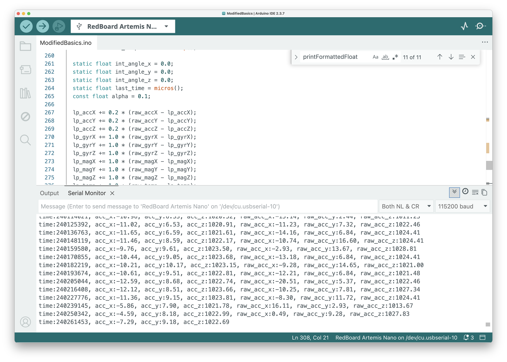
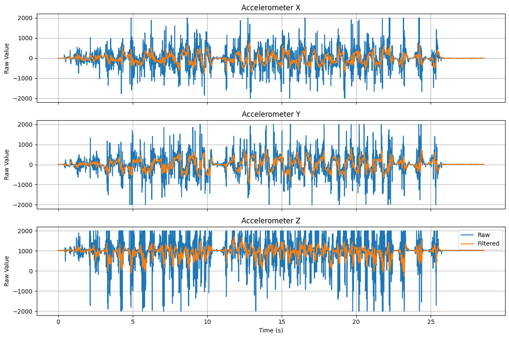
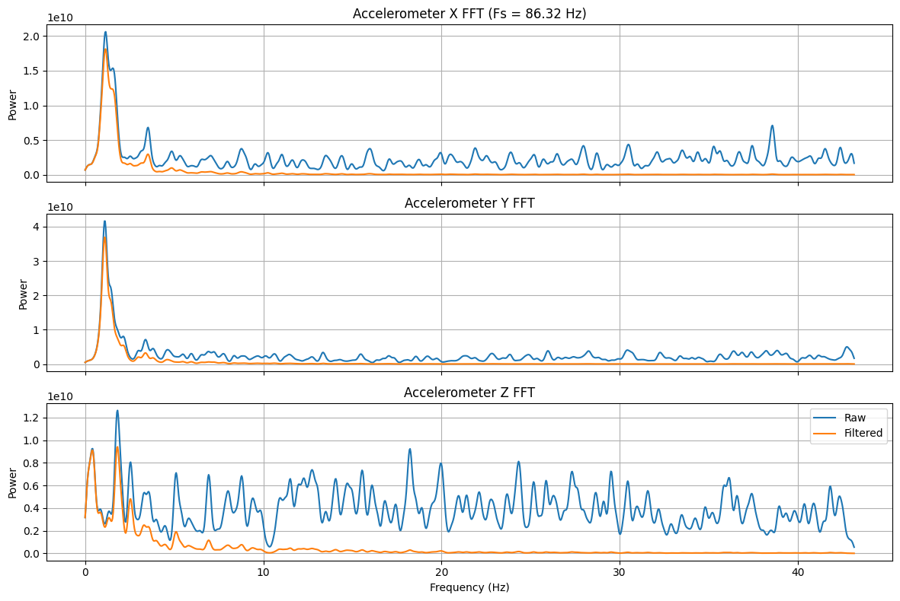

# Lab 2: IMU

## Setup

I connected the ICM-20948 IMU to the Artemis Nano over I2C (QWIIC connector). After running the IMU example code, the serial monitor shows accelerometer, gyroscope, and magnetometer data streaming in real time:

## 

## Accelerometer

### Pitch and Roll from Accelerometer

Using the accelerometer's gravity vector, pitch and roll can be computed with:

$$\theta_\text{pitch} = \arctan\left(\frac{a_x}{\sqrt{a_y^2 + a_z^2}}\right)$$

$$\phi_\text{roll} = \arctan\left(\frac{a_y}{\sqrt{a_x^2 + a_z^2}}\right)$$

These use the two-axis formulas to avoid the singularity issues of the simpler `atan2(a_x, a_z)` approach.

### Raw Accelerometer Data

Here is the raw accelerometer data captured over Bluetooth while driving the robot back and forth:



The Z axis hovers around ~1000 mg (from gravity) while the robot is flat. The X and Y axes show large excursions when the robot is accelerating, turning, or running into obstacles.

### Frequency Spectrum

The FFT of the raw accelerometer data (sampling rate ≈ 132 Hz):



The spectrum shows energy across the full bandwidth, however most of the useful signal below ~5 Hz and there is considerable noise at higher frequencies. This provides reason to apply a low-pass filter to the accelerometer data.

---

## Low-Pass Filter

### Implementation

I implemented a simple low-pass filter on the accelerometer data directly on the Artemis with α = 0.2:

```cpp
const float alpha = 0.2;

lp_accX += alpha * (raw_accX - lp_accX);
lp_accY += alpha * (raw_accY - lp_accY);
lp_accZ += alpha * (raw_accZ - lp_accZ);
```

This corresponds to a cutoff frequency of approximately:

$$f_c = \frac{\alpha \cdot f_s}{2\pi(1 - \alpha)} \approx \frac{0.2 \times 86}{2\pi \times 0.8} \approx 3.4\,\text{Hz}$$

Here is the filtered code running on the Artemis, showing both the filtered and raw values in the serial monitor:



### Filtered vs Raw Data

The filtered (orange) vs raw (blue) accelerometer data over ~25 seconds:



The filtered signal has significantly smoother motion compared to the raw signal. Some of the larger scale motion is still included in the filtered signal, but the high-frequency noise is removed.

### Frequency Response Comparison

In order to evaluate if the low pass filter is correctly implemented, I compared the frequency response of the raw and filtered accelerometer data:



The raw signal (blue) has noise spread across the entire spectrum, while the filtered signal concentrates power below 5 Hz as desired.

---

## Gyroscope

<!-- TODO: This section needs data collection and plots -->

### Pitch, Roll, and Yaw from Gyroscope

The gyroscope measures angular velocity, so pitch, roll, and yaw angles are computed by integration:

$$\theta(t) = \theta(t-1) + \dot{\theta} \cdot \Delta t$$

where $\dot{\theta}$ is the gyroscope reading in degrees per second and $\Delta t$ is the time step.

```cpp
static float int_angle_x = 0.0;
static float int_angle_y = 0.0;
static float int_angle_z = 0.0;
static float last_time = micros();

float dt = (micros() - last_time) / 1e6;
last_time = micros();

int_angle_x += myICM.gyrX() * dt;
int_angle_y += myICM.gyrY() * dt;
int_angle_z += myICM.gyrZ() * dt;
```

<!-- TODO: Add plots showing gyro-derived pitch/roll/yaw -->
<!-- TODO: Discuss drift over time -->
<!-- TODO: Compare gyroscope angles with accelerometer angles side-by-side -->

---

## Complementary Filter

<!-- TODO: Collect data and add plots -->

A complementary filter fuses the accelerometer (low-frequency) and gyroscope (high-frequency) estimates:

$$\theta = (1 - \alpha) \cdot (\theta_\text{prev} + \dot{\theta}_\text{gyro} \cdot \Delta t) + \alpha \cdot \theta_\text{accel}$$

With a small α (e.g., 0.02–0.1), the filter trusts the gyroscope for fast changes and uses the accelerometer to correct drift over time.

<!-- TODO: Add plots showing complementary filter output vs raw accel vs raw gyro -->
<!-- TODO: Discuss chosen alpha value and its effect -->

---

## Sample Data

### Fast Sampling

The main loop runs as fast as possible, reading the IMU whenever new data is available:

```cpp
void loop() {
    BLEDevice central = BLE.central();
    if (central) {
        while (central.connected()) {
            read_imu();
            write_data();
            read_data();
        }
    }
}
```

The `read_imu()` function pushes all 9 axes of data (accelerometer, gyroscope, magnetometer) plus a timestamp into circular buffers:

```cpp
void read_imu() {
    const int time = micros();
    if (myICM.dataReady()) {
        myICM.getAGMT();
        imu_times.push(time);
        imu_acc_x.push(myICM.accX());
        // ...
    }
}
```

### Circular Buffer

I wrote a templated `CircularBuffer` class that uses a power-of-two size with bitmask indexing for efficient push/pop:

```cpp
template<class T, int Size>
struct CircularBuffer {
    constexpr static int Mask = Size - 1;
    T data[Size] = { 0 };
    int head = 0;
    int tail = 0;

    void push(const T& value) {
        data[head] = value;
        head = (head + 1) & Mask;
        if (head == tail) {
            tail = (tail + 1) & Mask;
        }
    }

    bool pop(T& value) {
        if (head == tail) return false;
        value = data[tail];
        tail = (tail + 1) & Mask;
        return true;
    }
};
```

Each buffer holds 256 entries (`0x100`). With 10 buffers (time + 9 axes), that's 10 × 256 × 4 bytes = 10 KB of RAM, well within the Artemis's 384 KB.

### Data Window

The firmware keeps only the most recent 5 seconds of data by trimming old entries based on the timestamp:

```cpp
const int threshold = time - 5000000; // 5 seconds in microseconds
while (!imu_times.is_empty() && imu_times.top() > threshold) {
    imu_times.pop();
    imu_acc_x.pop();
    // ... pop all buffers
}
```

At the observed sampling rate of ~86–132 Hz, 5 seconds of data easily fits within the 256-entry buffer.

---

## Record a Stunt

<video width="100%" controls>
  <source src="videos/stunt.mov" type="video/mp4">
</video>

---

## Conclusion

I integrated the ICM-20948 IMU with the Artemis and can stream accelerometer, gyroscope, and magnetometer data over BLE. The raw accelerometer data is noisy, but a simple LPF with α=0.2 effectively removes high-frequency noise while preserving the motion signal. The remaining work is to implement and tune the complementary filter, which combines the drift-free accelerometer with the responsive gyroscope for robust angle estimates.
