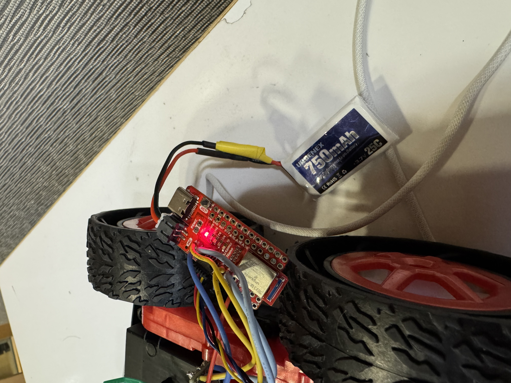
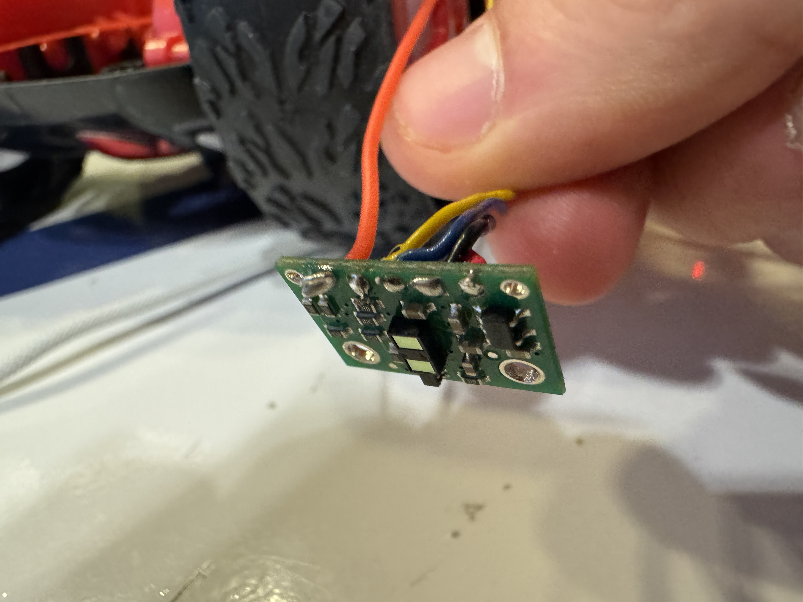
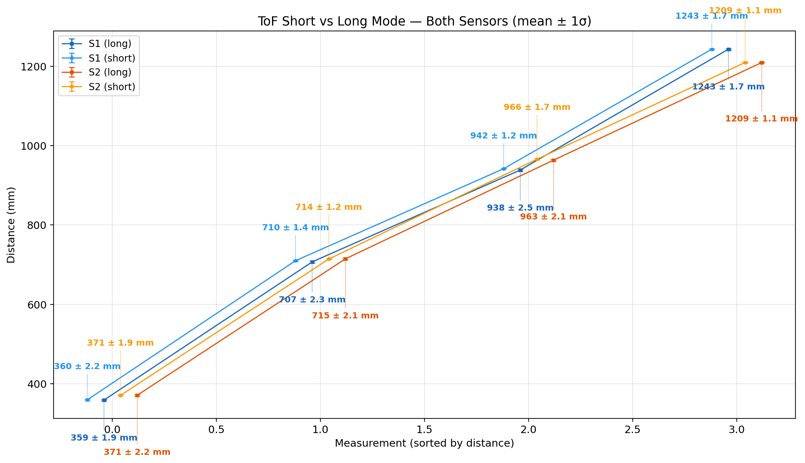
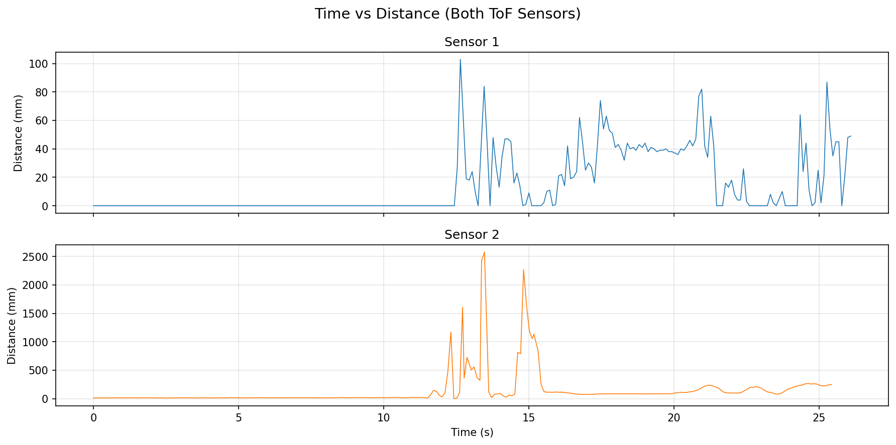
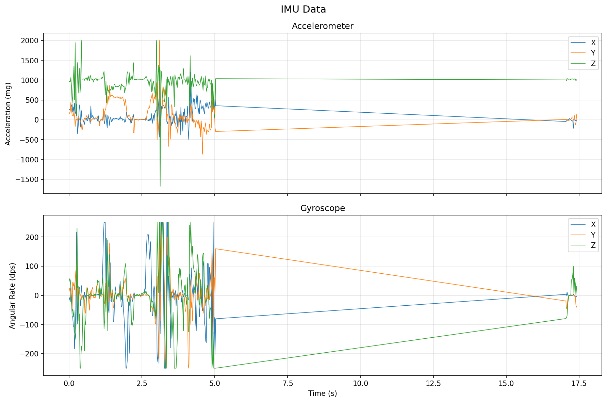

# Lab 3: Time of Flight Sensors

## Prelab

### I2C Address

The VL53L1X ToF sensor has a default I2C address of `0x52` (which shows up as `0x29` in the 7-bit format since the Arduino I2C scanner drops the R/W bit). Both sensors ship with this same address, so we can't talk to them independently without changing one.

### Using Two ToF Sensors

Since both sensors share the same I2C address, I'm using the XSHUT pin to change one sensor's address at boot. Here's the approach:

1. Wire the XSHUT pin of one sensor to a GPIO on the Artemis
2. At startup, hold that sensor in shutdown (pull XSHUT low)
3. Change the address of the other sensor using `setI2CAddress()`
4. Bring the second sensor back up, which will have the default address
5. Now they have different addresses and can be read independently

```
ToF sensor 2 online at address 0x54!
ToF sensor 1 online at address 0x29!
```

### Wiring

The Artemis connects to the QWIIC breakout board, which acts as a splitter, and both ToF sensors and the IMU all share the same I2C bus through it. Each sensor has a QWIIC cable soldered on.

The XSHUT pin on one ToF sensor is wired to a GPIO on the Artemis so we can hold it in shutdown during boot and reassign the other sensor's address.


---

## Battery & Artemis Power

I soldered a JST connector to the 750mAh battery. Key things:

- Cut battery wires one at a time
  - cutting both simultaneously shorts the terminals and kills the battery
- Used heat shrink to insulate the solder joints.
- Double-checked polarity before plugging in — positive on the battery to positive on the Artemis



---

## ToF Sensor Setup

### Hardware Connection

I connected the first ToF sensor to the QWIIC breakout board using a QWIIC cable — cut one end and soldered it to the sensor pads. The wire colors are:

- Black -> GND
- Red -> 3.3V
- Blue -> SDA
- Yellow -> SCL



---

## Ranging Mode Selection

The VL53L1X has three distance modes:

- **Short (1.3m)** — faster ranging and better ambient light immunity, but very limited range
- **Long (4m, default)** — max range, but slower and more affected by ambient light

---

## ToF Sensor Characterization

I updated my BLE code from lab 2 and added the ability to read the ToF sensor. I collected samples over BLE through a Jupyter notebook, then computed the mean, std deviation, and error for each measurement.



From these tests, I learned that both sensors are fairly accurate at a range of distances, I did not notice a a huge difference in accuracy, but it was faster to measure in short mode.

---

## Two ToF Sensors

After wiring both sensors to the QWIIC breakout board (with XSHUT on one), the startup code changes one address so both can run simultaneously.

The firmware uses `distanceSensor.checkForDataReady()` to read each sensor non-blockingly, pushing timestamped readings into circular buffers:

```cpp
void read_tof() {
  if (distanceSensor1.checkForDataReady()) {
    const int time = micros();
    int distance = distanceSensor1.getDistance();
    distanceSensor1.clearInterrupt();
    tof1_times.push(time);
    tof1_dist.push(distance);
  }

  if (distanceSensor2.checkForDataReady()) {
    const int time = micros();
    int distance = distanceSensor2.getDistance();
    distanceSensor2.clearInterrupt();
    tof2_times.push(time);
    tof2_dist.push(distance);
  }
}
```

<!-- TODO: Screenshot or photo showing both sensors connected and reading simultaneously -->
<!-- TODO: Show that both sensors return independent, valid data -->

---

## ToF Sensor Speed

The main loop uses `checkForDataReady()` to poll each sensor without blocking, so the loop itself runs much faster than the sensors can produce readings.

```
ToF1: 255 samples, 9.7 samples/sec (26.09s window)
ToF2: 255 samples, 10.0 samples/sec (25.42s window)
```

Throughput is about 10 samples per second.

---

## Time vs Distance

I recorded timestamped ToF data from both sensors over BLE and plotted distance vs time.



## IMU vs Distance

I also recorded and timestamped the IMU data and plotted it against time.


