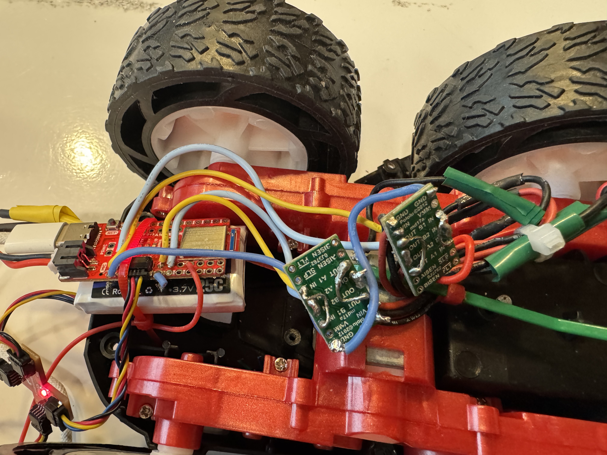
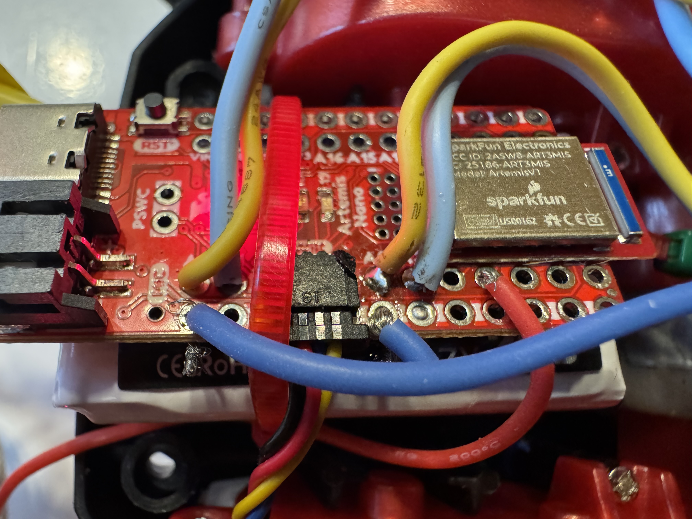
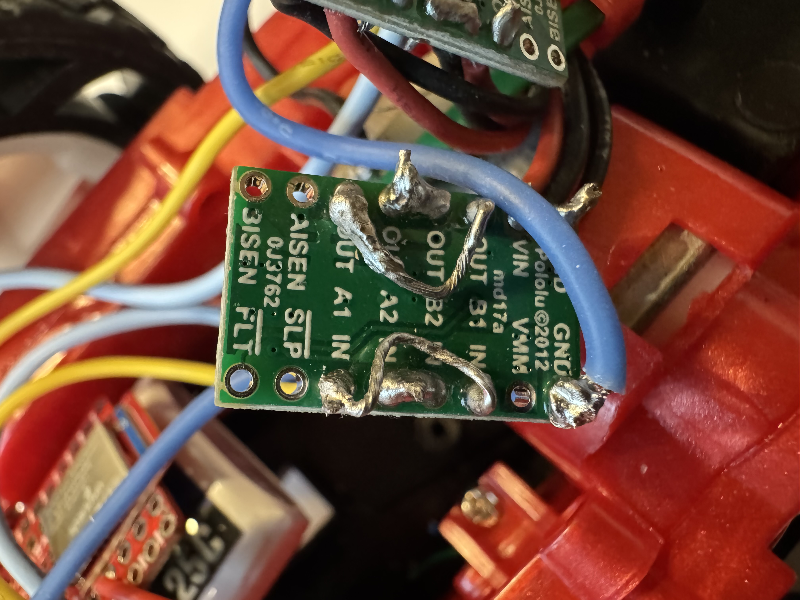
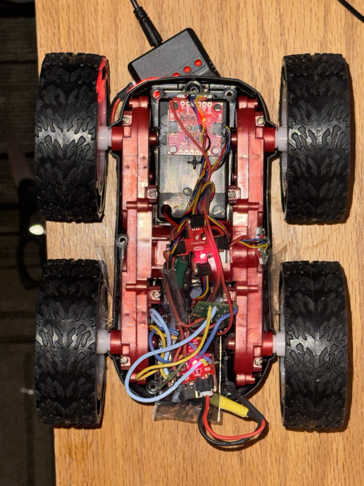

# Lab 4: Motor Drivers and Open Loop Control

## Prelab

### Wiring Diagram

Each dual motor driver has two H-bridge channels. The robot draws more current than a single channel can supply, so both channels on each driver are coupled. Both inputs are tied together, and both outputs are tied together. Both channels share the same clock on one IC, so parallel coupling is safe.

The setup is:

- Motor Driver 1 controls the left motor
- Motor Driver 2 controls the right motor



### Pin Selection

I chose pins A0/A1 for Motor 1 (left) and A2/A3 for Motor 2 (right). All four pins support PWM output via `analogWrite()`, and they sit close together on the board, which keeps wiring short inside the chassis.



### Battery Discussion

The Artemis and the motors use separate batteries. Motors generate large current spikes when starting, stalling, or reversing. These spikes cause voltage drops that can reset the Artemis or corrupt sensor readings. Separate power rails keep the digital logic stable while the motors draw variable current.

The 850mAh Li-Ion battery powers the motors (higher current capacity), and the 750mAh battery powers the Artemis and sensors.

---

## Motor Driver Setup

### External Power Supply Testing

I tested one motor driver powered from an external power supply instead of the battery. This makes debugging easier because I can set current limits and observe the output directly.



### PWM Signal Verification

I used `analogWrite()` to generate PWM signals to the motor driver inputs and verified the output on an oscilloscope. The test code sweeps through duty cycles of 50, 100, 150, and 200 (out of 255) on each motor, pausing between each step for waveform observation:

```cpp
void motors_init() {
  pinMode(MOTOR1_FWD, OUTPUT);
  pinMode(MOTOR1_REV, OUTPUT);
  pinMode(MOTOR2_FWD, OUTPUT);
  pinMode(MOTOR2_REV, OUTPUT);

  for (int k = 50; k <= 200; k += 50) {
    analogWrite(MOTOR2_FWD, k);
    delay(3000);
    motors_stop();
    delay(1000);
    analogWrite(MOTOR1_FWD, k);
    delay(3000);
    motors_stop();
    delay(1000);
  }
}
```

### Single Motor Spin Test

With the car on its side and wheels off the ground, I confirmed each motor spins in both directions over BLE. I tested each motor at full throttle (PWM 255) forward and reverse:

```python
# Motor 1 forward
ble.send_command(CMD.MOTOR_CMD, "255|0")
time.sleep(3)
ble.send_command(CMD.MOTOR_STOP, "")

# Motor 1 reverse
ble.send_command(CMD.MOTOR_CMD, "-255|0")
time.sleep(3)
ble.send_command(CMD.MOTOR_STOP, "")

# Motor 2 forward
ble.send_command(CMD.MOTOR_CMD, "0|255")
time.sleep(3)
ble.send_command(CMD.MOTOR_STOP, "")

# Motor 2 reverse
ble.send_command(CMD.MOTOR_CMD, "0|-255")
time.sleep(3)
ble.send_command(CMD.MOTOR_STOP, "")
```

The `set_motor()` function zeros the inactive pin before driving the active one. This prevents both H-bridge sides from being high at the same time:

```cpp
static void set_motor(int fwd_pin, int rev_pin, int speed) {
  if (speed > 0) {
    analogWrite(rev_pin, 0);
    analogWrite(fwd_pin, speed);
  } else if (speed < 0) {
    analogWrite(fwd_pin, 0);
    analogWrite(rev_pin, -speed);
  } else {
    analogWrite(fwd_pin, 0);
    analogWrite(rev_pin, 0);
  }
}
```

---

## Battery Power

After verifying everything on the bench supply, I switched to the 850mAh battery for motor power. I checked wire polarity before plugging in, then confirmed both motors still work without the external supply.

---

## Assembly

I mounted all components inside the RC car chassis, keeping everything below the wheel line so nothing protrudes when the car flips. I used tape to secure the motor drivers and Artemis board. The battery is held underneath an electrostatic bag, which is screwed to the chassis. The time of flight sensor is mounted on the front with double-sided tape, and the QWIIC breakout board is mounted next to it.



---

## Lower PWM Limit

I swept PWM values steps of 10 to find the minimum value that moves the robot from rest. I tested both straight-line driving and on-axis turns:

```python
# Forward sweep
for pwm in range(20, 180, 10):
    ble.send_command(CMD.MOTOR_CMD, f"{pwm}|{pwm}")
    time.sleep(1.5)
    ble.send_command(CMD.MOTOR_STOP, "")
    time.sleep(1.0)

# turn sweep
for pwm in range(20, 180, 10):
    ble.send_command(CMD.MOTOR_CMD, f"{pwm}|{-pwm}")
    time.sleep(1.5)
    ble.send_command(CMD.MOTOR_STOP, "")
    time.sleep(1.0)
```

---

## Calibration

The two motors do not spin at the same rate, so the robot drifts to one side. I added a calibration factor that scales Motor 2's PWM to match Motor 1:

```cpp
static void set_motors(int left, int right) {
  int cal_right = constrain((int)(right * motor2_cal), -PWM_MAX, PWM_MAX);
  set_motor(MOTOR1_FWD, MOTOR1_REV, left);
  set_motor(MOTOR2_FWD, MOTOR2_REV, cal_right);
  motors_active = (left != 0 || right != 0);
  if (motors_active) motor_start_time = millis();
}
```

The calibration factor is settable over BLE with `MOTOR_CAL`, so I can tune it without re-flashing. I set the factor, then drove the robot at PWM 150 for 4 seconds starting on a tape line:

```python
CAL_FACTOR = 1.0  # adjust empirically
ble.send_command(CMD.MOTOR_CAL, str(CAL_FACTOR))

ble.send_command(CMD.MOTOR_CMD, f"150|150")
time.sleep(4)
ble.send_command(CMD.MOTOR_STOP, "")
```

During calibration testing, both motor controllers burned out. The DRV8833 chips stopped responding to PWM input and no longer drove the motors. I was unable to complete the calibration factor tuning or the straight-line test before the drivers failed. I will replace both motor controllers before continuing with the remaining tasks.

---

## Open Loop Demo

I wrote an untethered autonomous sequence: forward, right turn, forward, left turn, forward. The turns are on-axis spins where one motor runs forward and the other runs in reverse:

```python
DRIVE = 150   # cruising PWM
TURN = 120    # turning PWM

# Forward
ble.send_command(CMD.MOTOR_CMD, f"{DRIVE}|{DRIVE}")
time.sleep(2)

# Right turn (spin in place)
ble.send_command(CMD.MOTOR_CMD, f"{TURN}|{-TURN}")
time.sleep(0.5)

# Forward
ble.send_command(CMD.MOTOR_CMD, f"{DRIVE}|{DRIVE}")
time.sleep(2)

# Left turn
ble.send_command(CMD.MOTOR_CMD, f"{-TURN}|{TURN}")
time.sleep(0.5)

# Forward
ble.send_command(CMD.MOTOR_CMD, f"{DRIVE}|{DRIVE}")
time.sleep(2)

ble.send_command(CMD.MOTOR_STOP, "")
```

I was unable to run this sequence on the robot due to the fried motor controllers. The code is ready to test once the replacement drivers are installed. Open loop control is not repeatable in general. Each run ends in a different position due to battery voltage changes, floor surface differences, and wheel slip. It will serve as a baseline for autonomous movement before sensor feedback is added in later labs.
