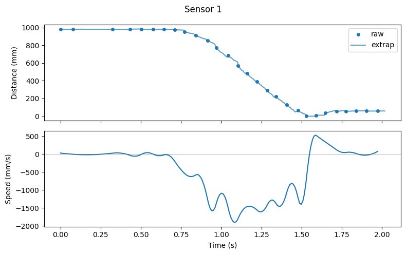
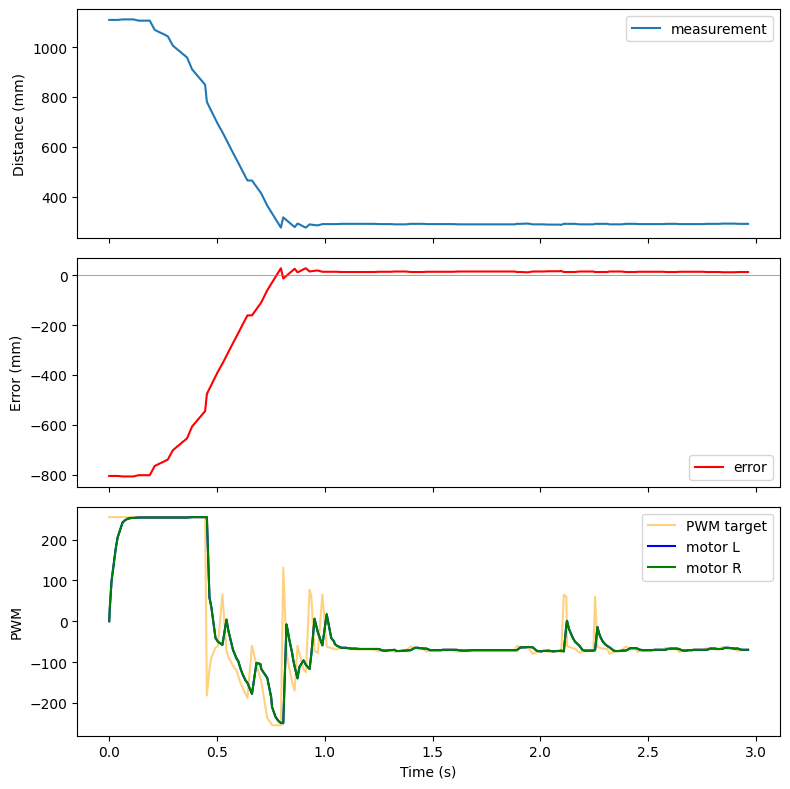
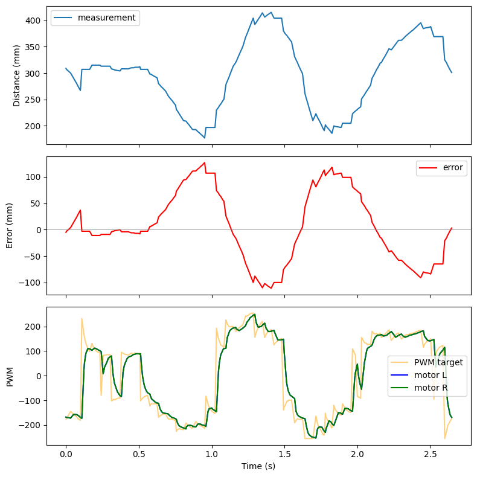
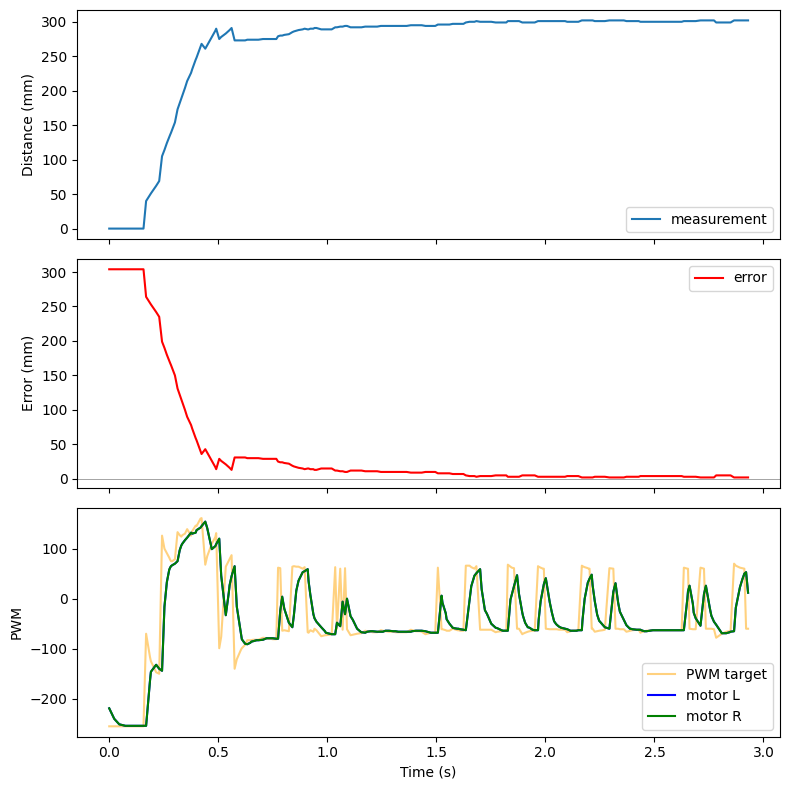

# Lab 5: Linear PID and Linear Interpolation

## Prelab

### BLE Debugging Infrastructure

The robot runs PID control entirely on the Artemis. A computer sends a `PID_START` command over BLE with a duration (e.g. 3000ms). The Artemis executes the PID loop at full speed, storing timestamped debug data in circular buffers. Once the duration expires, the controller stops the motors and waits. The computer then sends `SEND_PID_DATA` to retrieve all logged samples over BLE.

Each sample contains nine fields: timestamp, ToF measurement, error, PWM target, left motor output, right motor output, and the P/I/D branch outputs. All values are stored as integers in circular buffers of 256 entries.

```cpp
times.push((int)(micros()));
measurement.push(distance);
error_buf.push((int)(setpoint - distance));
motor_out.push(pwm);
motor_left.push((int)(motors::current_left));
motor_right.push((int)(motors::current_right));
p_buf.push((int)(controller.p_out));
i_buf.push((int)(controller.i_out));
d_buf.push((int)(controller.d_out));
```

A 500ms motor watchdog on the Artemis stops the motors if no control update arrives, providing a hard stop safety mechanism independent of BLE.

### BLE Gain Tuning

Separate BLE commands (`PID_GAINS`, `PID_PARAMS`, `PID_SETPOINT`) update gains, integrator limits, derivative filter constant, and deadband without reflashing.

---

## P/I/D Discussion

### Controller Selection

I chose a PD controller (Kp=0.75, Ki=0, Kd=0.15). The proportional term handles the primary drive toward the setpoint. The derivative term damps oscillation as the robot approaches the wall. An integrator was unnecessary because the deadband offset already forces the motors past static friction, and the proportional gain is sufficient to eliminate steady-state error at 304mm.

### Gain Selection

The ToF sensor returns distances up to ~1300mm in short mode. At a starting distance of 0mm (error = 304mm), the proportional term alone produces 0.75 \* 304 = 228. After adding the deadband offset of 80, the output saturates at PWM 255. This means the robot drives at full power for most of the approach and only begins to modulate near the setpoint.

I started with Kp alone and increased it until the robot reached the wall aggressively. Then I added Kd to damp the overshoot. Increasing Kd beyond 0.15 caused the robot to slow too early, while lower values allowed oscillation around the setpoint.

---

## Sensor Configuration

### TOF Range and Sampling Time

I used short distance mode. Short mode has a maximum range of ~1.3m, which is sufficient for short tests. Short mode provides faster update rates than long mode.

The ToF sensor is read in a non-blocking state machine. Each loop iteration checks `checkForDataReady()` and only reads when data is available. This avoids blocking the main loop.

---

## PID Implementation

### Control Loop

The PID loop runs every main loop iteration. It calls `tof::methods::current1()` which returns an extrapolated distance estimate. If no ToF data is available yet, it returns -1 and the loop skips that iteration. The PID output is negated because a positive error (robot is too far) should produce forward motion (negative ToF direction).

```cpp
int distance = tof::methods::current1();
float output = -controller.compute((float)distance, setpoint);
int pwm = to_pwm(output);
motors::methods::set(pwm, pwm);
```

### Deadband Handling

The `to_pwm()` function maps the PID output to motor PWM. It adds the deadband offset (80) to any nonzero output so that the motors always receive enough voltage to move:

```cpp
static int to_pwm(float output) {
    if (output > 0)
        return constrain((int)output + deadband, 0, PWM_MAX);
    else if (output < 0)
        return constrain((int)output - deadband, -PWM_MAX, 0);
    return 0;
}
```

### PID Controller

I wrote a reusable `PID` class in `lib_PID.h`. It tracks `dt` internally via `micros()` and exposes the P, I, and D branch outputs for logging:

```cpp
float compute(float measurement, float setpoint = 0) {
    long now_us = micros();
    bool first = (prev_time == -1);
    if (first) prev_time = now_us - 1;

    float error = setpoint - measurement;
    long dt_us = now_us - prev_time;
    float dt = dt_us * 1e-6f;

    // Proportional
    p_out = kP * error;

    // Integral with wind-up protection
    if (integrator_range == 0 ||
        (-integrator_range < error && error < integrator_range)) {
        integral += error * dt;
        integral = constrain(integral, -integrator_cap, integrator_cap);
    } else {
        integral = 0;
    }
    i_out = kI * integral;

    // Derivative on measurement (avoids derivative kick)
    if (first) {
        d_out = 0;
        d_filter.reset();
        d_filter.filter(0);
    } else {
        float raw_derivative = (prev_measurement - measurement) / dt;
        d_out = kD * d_filter.filter(raw_derivative);
    }

    prev_error = error;
    prev_measurement = measurement;
    prev_time = now_us;
    return p_out + i_out + d_out;
}
```

### Derivative Smoothing

The raw derivative is smoothed through a first-order low-pass filter with RC = 0.02s.

---

## Linear Extrapolation

### Extrapolation Function

The ToF sensor updates at roughly 50Hz. The PID loop runs much faster. Between sensor updates, the `extrapolate()` function projects the current distance using the slope of the two most recent readings:

```cpp
float slope = (float)(dists[0] - dists[1]) / (float)dt;
int extrapolated = dists[0] + (int)(slope * (float)elapsed);
```

The function includes two safety checks: if the direction of motion reverses (last two slopes have opposite signs), it returns the most recent reading instead of extrapolating. If more than 500ms has elapsed since the last reading, it also returns the raw value.

<!-- TODO: Add comparison plot of raw TOF data vs. extrapolated data -->

---

## Results

### Speed

The front ToF sensor data shows the robot reaches a maximum approach speed of approximately 1500 mm/s during the forward run. The following plot shows the distance derivative computed from the ToF readings:



### Plots

The following plots show three PID runs. Each plot has three subplots: ToF distance vs. time, error vs. time, and motor PWM vs. time. The setpoint is 304mm (1 foot).

**Forward approach from ~2m:**



<video controls width="100%">
  <source src="images/forwards_pid.MOV" type="video/quicktime">
</video>

**Perturbation test (foot moving back and forth):**

The robot tracks a foot moving toward and away from it, maintaining the 304mm setpoint distance.



<video controls width="100%">
  <source src="images/foot_pid.MOV" type="video/quicktime">
</video>

**Perturbation test (pushed backward):**



<video controls width="100%">
  <source src="images/backwards_pid.MOV" type="video/quicktime">
</video>
