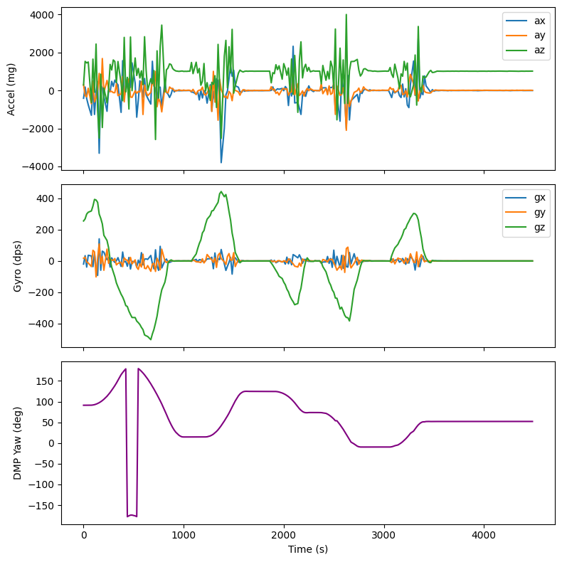
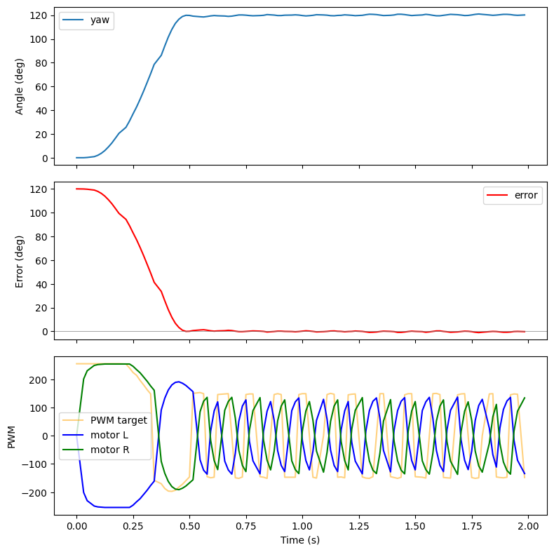

# Lab 6: Orientation PID

## Prelab

### BLE Debugging Infrastructure

The orientation controller uses the same PID controller from Lab 5. A computer sends an `ANGLE_PID_START` command over BLE with a duration. The Artemis runs the control loop at full speed, storing timestamped data in circular buffers. The computer retrieves logged samples via `SEND_ANGLE_PID_DATA`.

Each sample: timestamp, relative angle, error, PWM output, left / right motor command, and the P / D outputs. All values are stored as integers in circular buffers of 256 entries.

Separate BLE commands allow real-time tuning without reflashing: `ANGLE_PID_GAINS` sets $K_p$ and $K_d$, `ANGLE_PID_SETPOINT` changes the target angle, and `ANGLE_PID_PARAMS` adjusts the derivative low-pass filter time constant and output deadband.

---

## P/I/D Discussion

### Controller Selection

I chose a PD controller. The proportional term drives the robot toward the target angle. The derivative term damps oscillation. An integral term was unnecessary because the DMP yaw measurement has no steady-state offset that would require correction.

### Gain Selection

The controller operates on angle error in degrees. At a 90-degree setpoint, the proportional term alone produces $K_p \cdot 90$. $K_p$ was increased until the robot rotated aggressively to the target, then $K_d$ was added to suppress overshoot and ringing. The derivative term acts on the rate of change of the measured angle, smoothed through a first-order low-pass filter to reduce noise.

### Derivative on Measurement

The PID controller computes the derivative on the measurement rather than the error. This avoids derivative kick when the setpoint changes. The yaw measurement is itself an integrated quantity (the DMP fuses gyroscope data over time), so differentiating it recovers an angular rate. Because the DMP outputs a float, the derivative is clean and does not suffer from quantization noise, which would appear when differentiating an integer reading. A low-pass filter on the derivative term also provides additional smoothing:

```cpp
float raw_derivative = (prev_measurement - measurement) / dt;
d_out = kD * d_filter.filter(raw_derivative);
```

---

## IMU: DMP Yaw

### Why DMP

Raw gyroscope integration drifts over time. The on-chip Digital Motion Processor that fuses accelerometer and gyroscope data into a quaternion estimate. This provides less drift without manual sensor fusion or complementary filtering.

### DMP Initialization

I initialize the DMP with the game rotation vector sensor (6-axis, no magnetometer), max output data rate, and FIFO enabled:

```cpp
myICM.initializeDMP();
myICM.enableDMPSensor(INV_ICM20948_SENSOR_GAME_ROTATION_VECTOR);
myICM.setDMPODRrate(DMP_ODR_Reg_Quat6, 0);
myICM.enableFIFO();
myICM.enableDMP();
myICM.resetDMP();
myICM.resetFIFO();
```

### Quaternion to Yaw

Each loop iteration reads the DMP FIFO. If a Quat6 packet is available, I convert the quaternion to yaw with `atan2`:

```cpp
float siny_cosp = 2.0f * (q0 * q3 + q1 * q2);
float cosy_cosp = 1.0f - 2.0f * (q2 * q2 + q3 * q3);
yaw = atan2f(siny_cosp, cosy_cosp) * 180.0f / (float)M_PI;
```

The plot below shows DMP yaw during a manual rotation test. Stable, no visible drift:



---

## PID Implementation

### Relative Angle Control

On start, the controller records the current yaw as an offset. All measurements are relative to this starting orientation, so a setpoint of 90 degrees means "90 degrees from where I am now."

```cpp
yaw_offset = imu::yaw;
// ...
float rel_angle = wrap_angle(imu::yaw - yaw_offset);
float error = wrap_angle(setpoint - rel_angle);
```

### Angle Wrapping

Yaw wraps at +/-180 degrees. Without handling this, crossing the boundary causes a 360-degree error spike. `wrap_angle` normalizes to [-180, 180]:

```cpp
static float wrap_angle(float angle) {
    return angle - 360.0f * roundf(angle / 360.0f);
}
```

### Differential Drive

Left and right motors spin in opposite directions. Positive PWM spins clockwise:

```cpp
motors::methods::set(-pwm, pwm);
```

### Deadband Compensation

`to_pwm` maps PD output to motor PWM. Jumping straight to the minimum effective PWM (80) overcomes static friction but prevents settling. Instead, within the input deadband (16), output ramps linearly from 0 to 120, allowing it to come to rest, while also overcoming static friction at small pwms.

```cpp
static int to_pwm(float output) {
    float abs_v = fabs(output);
    float sign = output > 0 ? 1.0 : -1.0;
    if (abs_v <= in_deadband) {
        return (int)(sign * abs_v *
                     ((float)out_deadband / in_deadband));
    }
    int pwm = (int)(sign * (out_deadband +
                            (abs_v - in_deadband) *
                                (PWM_MAX - out_deadband) /
                                (PWM_MAX - in_deadband)));
    return constrain(pwm, -PWM_MAX, PWM_MAX);
}
```

---

## Results

Angle PID response. Setpoint and measured angle, error, and motor PWM over time:



---

## Demo

In-place orientation control. The robot rotates to the target angle and holds:

<video controls width="100%">
  <source src="images/angle_pid.MOV" type="video/mp4">
</video>
