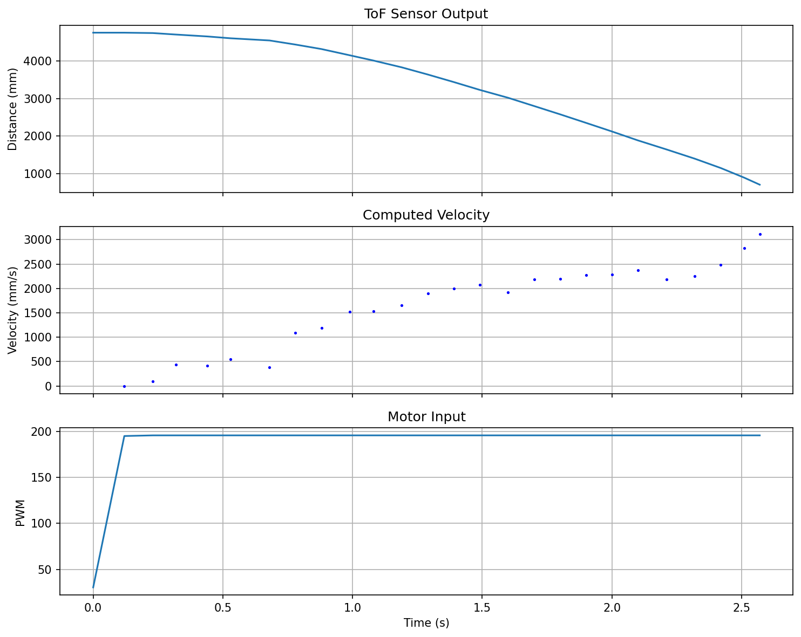
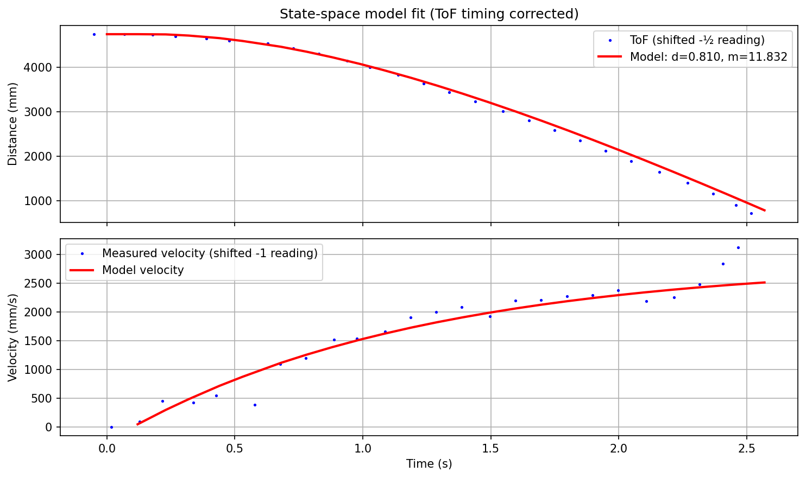
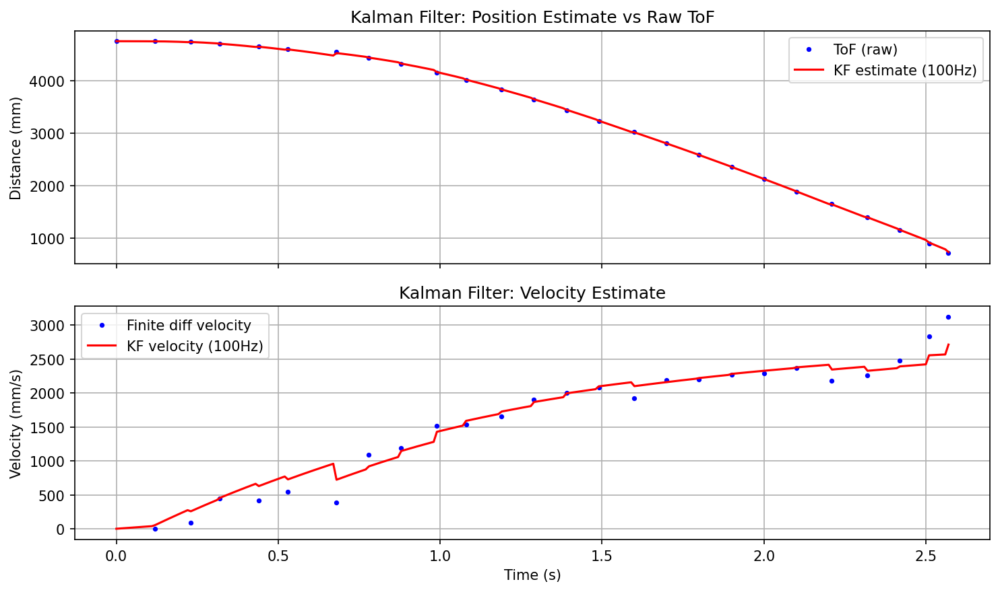
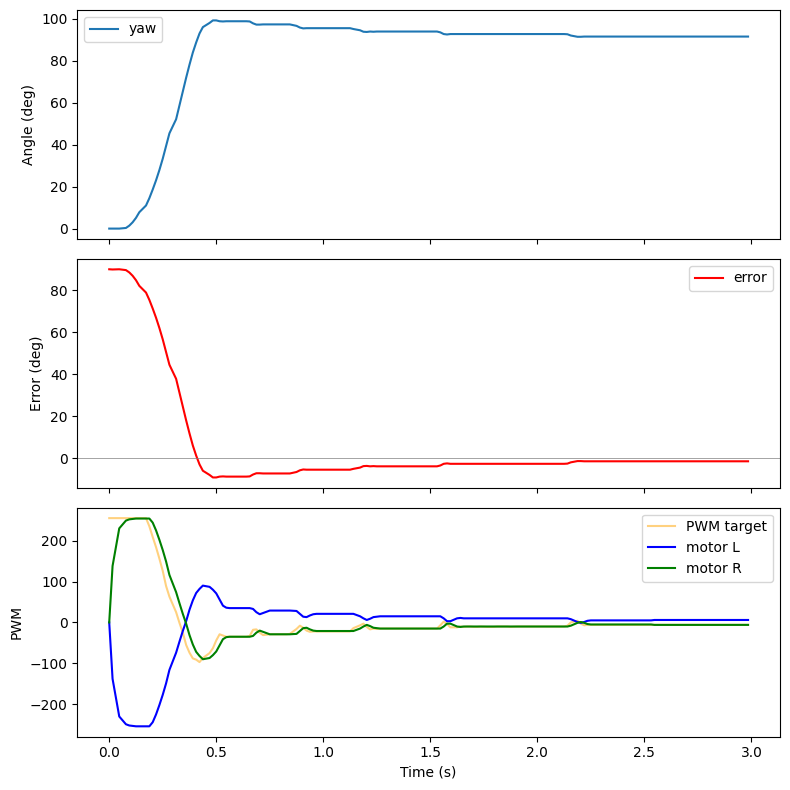

# Lab 7: Kalman Filtering

## Step Response

To estimate the drag and momentum parameters for the state space model, I drove the robot toward a wall at a constant PWM of 192 (out of 255) while logging ToF distance and motor input at each timestep.

The plot below shows raw ToF distance, computed velocity, and motor input over time:



The robot reaches a steady-state speed of approximately ~2500 mm/s. The ToF sensor samples at roughly 10 Hz (103 ms average interval).

---

## Drag and Momentum Estimation

Rather than fitting an analytical step response, I simulated the discrete state space model forward using the actual PWM inputs and variable dt from the data. The state is $[\text{distance}, \text{velocity}]^T$, with dynamics:

$$\dot{v} = -d \cdot v - m \cdot u$$

where $d$ is drag and $m$ is the momentum term. Two details improve the fit:

ToF readings have inherent latency: each measurement reflects the position inbetween measurements as it is based on the reflection. As such, position readings lag by about half a sampling interval. The velocity represents the average velocity over the interval, so it is more accurate to compare the model's predicted velocity at the midpoint of each interval to the finite-difference velocity computed from ToF readings.

I optimized both $d$ and $m$ jointly with `scipy.optimize.minimize`, using a soft constraint to keep the implied steady-state speed ($v_{ss} = m \cdot u / d$) within a reasonable range. This produced:

- Drag: $d = 0.810 1/\text{s}$ (time constant 1.24 s)
- Momentum: $m = 11.83 \text{mm}/\text{s}^2$ per PWM unit

The model fit against measured ToF data:



---

## State Space Model

The continuous-time matrices:

$$A = \begin{bmatrix} 0 & 1 \\ 0 & -d \end{bmatrix}, \quad B = \begin{bmatrix} 0 \\ -m \end{bmatrix}, \quad C = \begin{bmatrix} 1 & 0 \end{bmatrix}$$

$B$ is negative because positive PWM drives the robot forward, decreasing distance to wall.

Discretized at 100 Hz ($\Delta t = 0.01$ s) using forward Euler:

$$A_d = I + \Delta t \cdot A = \begin{bmatrix} 1 & 0.01 \\ 0 & 0.992 \end{bmatrix}, \quad B_d = \Delta t \cdot B = \begin{bmatrix} 0 \\ -0.118 \end{bmatrix}$$

---

## Kalman Filter (Python)

### Covariance Tuning

I tuned the process and measurement noise covariances by reasoning about the physical sources of uncertainty:

- $\sigma_{pos} = 1$ mm: the relationship between position and velocity is exact, so position process noise is small.
- $\sigma_{vel} = 100$ mm/s: models how accurate the the prediction of veloocity based on the previous velocity and motor input is. Having this be higher means the filter is not super confident in the model's velocity prediction and will be more responsive to changes in the ToF readings.
- $\sigma_{tof} = 50$ mm: the ToF sensor itself is accurate to about 20 mm, but I found that the measurements were more noisy than that during movement. To be fair, the kalman filter equation is more sensitive to the relative values of these covariances than their absolute values, so I set this to be lower than the observed noise to ensure the filter is responsive to measurements.

### Results

The Kalman filter output overlaid on raw ToF readings:



The filter tracks the measured distance and produces a smooth, continuous estimate at 100 Hz. The velocity estimate follows the finite-difference velocity without the noise spikes.

---

## Kalman Filter on Robot

The C++ implementation lives in `subsystem_kalman.h` and uses the `BasicLinearAlgebra` library for matrix operations. The structure mirrors the Python version: predict every loop iteration, update on new ToF data.

```cpp
void periodic() {
    motor_input = (motors::current_left + motors::current_right) / 2.0f;
    methods::predict(motor_input);

    if (tof::times1.size() > 0 && tof::times1[0] != last_tof_time) {
        last_tof_time = tof::times1[0];
        methods::update((float)tof::dist1[0]);
    }
}
```

The PID subsystem reads distance and velocity directly from the Kalman filter state. When `use_kf` is enabled, the PID controller calls `kalman::methods::distance()` for position and passes `kalman::methods::velocity()` as a pre-computed derivative to skip the PID's internal finite-difference and low-pass filter:

```cpp
float distance;
if (use_kf) {
    distance = kalman::methods::distance();
} else {
    distance = tof::methods::current1();
}

float vel = use_kf ? kalman::methods::velocity() : NAN;
float output = -controller.compute(distance, setpoint, vel);
```

The KF uses `motors::current_left` and `motors::current_right` as its control input. These are the low-pass filtered motor outputs, not the raw target PWM. This matches the Python model where the PWM is filtered before being fed into the dynamics.

BLE commands (`KF_PARAMS`, `KF_RESET`, `SEND_KF_DATA`) allow tuning parameters and retrieving logged data without reflashing.

---

## (EXTRA) DeSticker: More Consistent Method for Overcoming Static Friction

A common approach to the motor deadband is adding a fixed PWM offset so that the output jumps past the stiction threshold. This is difficult to tune: too low and the motor still stalls at low commanded speeds, too high and the motor creeps when the PID requests zero output. The stiction threshold also changes depending on what the robot is doing. Driving forward has less resistance than turning in place, where the wheels scrub sideways against the floor. A fixed offset tuned for forward motion will stall during turns, and one tuned for turns will cause unwanted creep when driving straight.

The DeSticker replaces the fixed offset with pulse-density modulation. It accumulates the requested PWM as energy over time and fires short kick pulses at a higher PWM (192) that reliably breaks static friction. The duty cycle of these pulses is proportional to the requested PWM, so the average torque tracks the PID output continuously. For smaller requested PWMs, the kicks are spaced further apart; for larger ones, they fire more frequently:



In the image above, you can see at small pwm values, the robot breaks the stiction in brief thresholds in order to overcome small errors.

The result is a mostly linear mapping from commanded PWM to wheel speed across the full range, including values that would otherwise fall in the deadband. This makes PID tuning straightforward since the controllers output is now mostly linear over long timescales.
