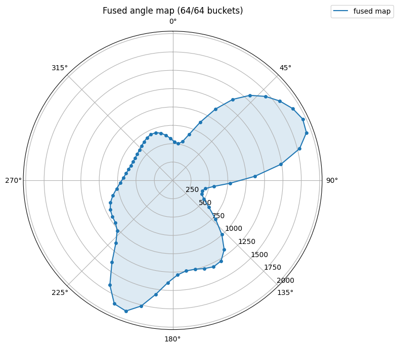
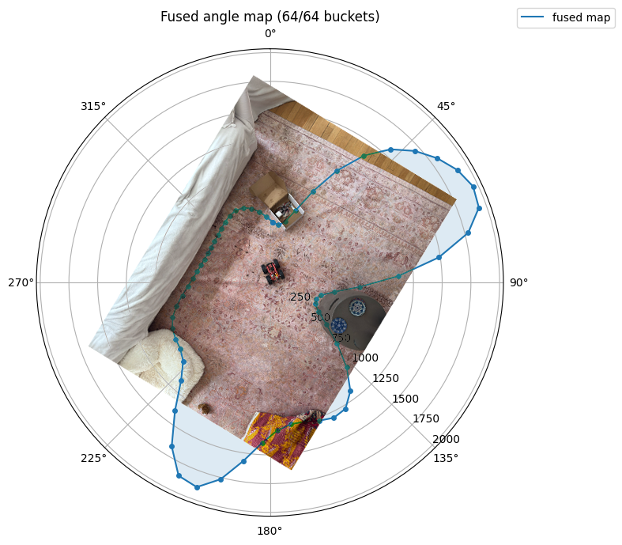
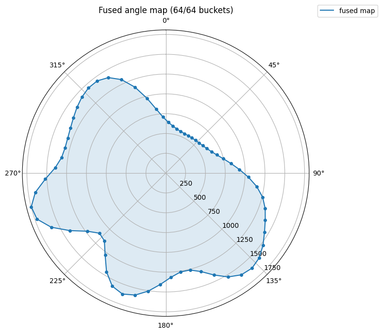
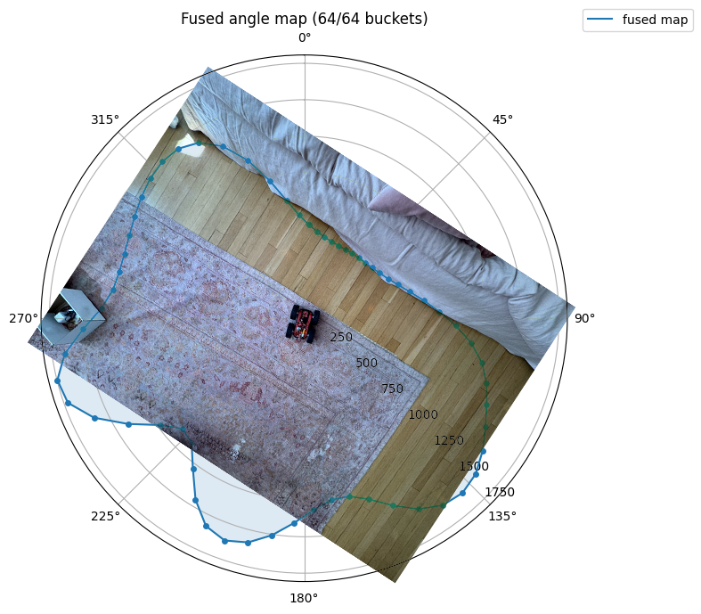
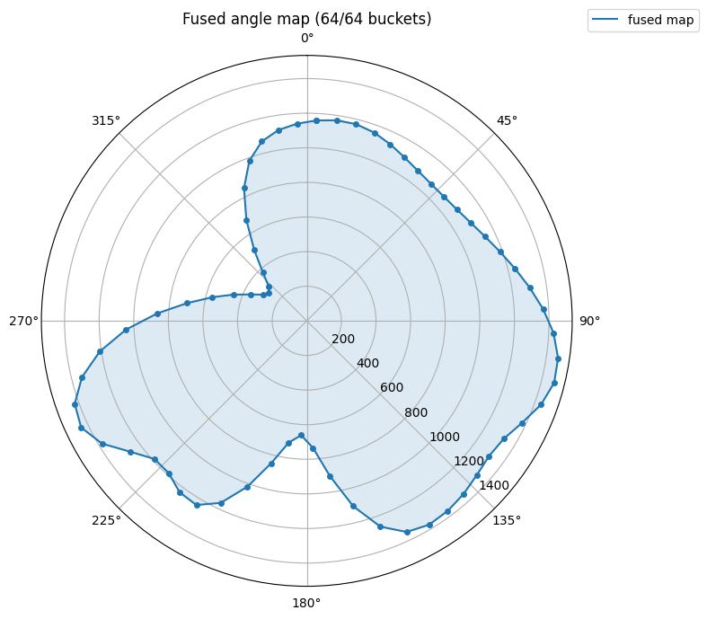
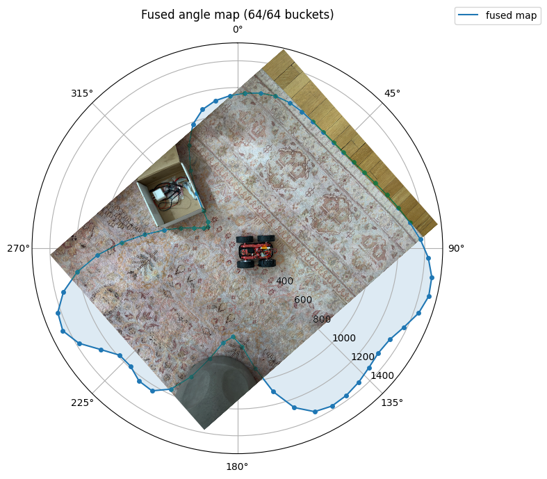
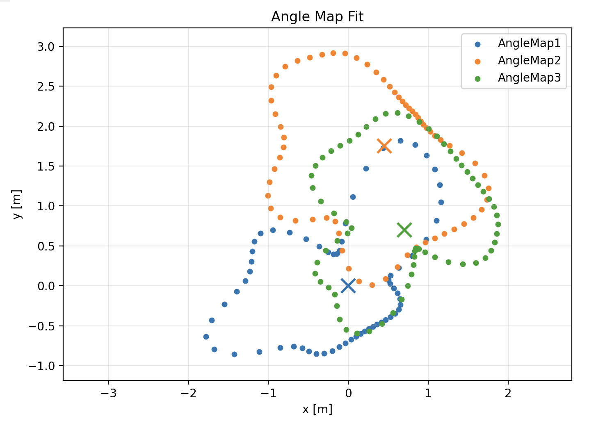

# Lab 9: Mapping

## Setup

I ran this lab at home instead of in the course lab space because I was traveling for CHI 2026 and could not bring the robot to Spain. The scans below are of three rooms in my apartment rather than the marked positions in the front room of the lab.


## Control

I reused the angle PID from the previous lab to step the robot through a full 360 degree rotation. The mapping subsystem sets a new absolute yaw setpoint, waits for the error to settle, then holds while the ToF sensors collect samples. Each step advances the setpoint by `360 / num_steps` degrees. I used 36 steps, so the robot stops every 10 degrees.

The angle PID is a PD controller on DMP yaw. I wrap the error to `[-180, 180]` before taking the derivative so the controller doesn't spike when yaw crosses the wrap boundary:

```cpp
static float wrap_angle(float angle) {
    return angle - 360.0f * roundf(angle / 360.0f);
}

float offset = wrap_angle(imu::yaw - setpoint);
float output = controller.compute(offset, 0);
int pwm    = to_pwm(output);
output_left  = -pwm;
output_right =  pwm;
```

The mapping subsystem is a small state machine with two phases. `TURNING` runs until yaw error stays below `settle_threshold` for `settle_time_ms`, then `SAMPLING` holds the setpoint fixed while fresh ToF reads come in. Both phases share a timeout so a stuck step doesn't stall the whole rotation:

```cpp
void update_turning() {
    const float err = fabsf(
        angle_pid::methods::wrap_angle(imu::yaw - angle_pid::setpoint)
    );
    if (err < settle_threshold) {
        if (!settled) { settled = true; settle_start_ms = millis(); }
        else if (millis() - settle_start_ms >= settle_time_ms) {
            begin_sampling();
            return;
        }
    } else {
        settled = false;
    }
    if (millis() - phase_start_ms >= step_timeout_ms)
        begin_sampling();
}
```

Settling before sampling matters because the VL53L1X gives bad readings when the beam sweeps across surfaces mid-acquisition. Holding still at each step means each sample actually points at a fixed direction in the room.

## Data Collection

Each stop collects ten fresh reads from each ToF sensor. The subsystem tracks the sensor read counter and only accepts a sample when the counter advances, so duplicates from the same acquisition get rejected:

```cpp
if (collected1 < samples_per_step && tof::reads1 > baseline_reads1) {
    baseline_reads1 = tof::reads1;
    const int raw = tof::dist1.size() > 0 ? tof::dist1[0] : -1;
    if (raw > 0) {
        map.update(imu::yaw, (float)raw, angle_std_deg);
        collected1++;
    }
}
```

Sensor 1 points forward. Sensor 2 is mounted 90 degrees clockwise on the chassis, so its beam hits the wall at `yaw - 90`. I account for this with a constant offset in the map update call:

```cpp
map.update(imu::yaw + sensor2_offset_deg, (float)raw, angle_std_deg);
```

With 36 stops and two sensors contributing ten samples each, every scan produces 720 raw distance measurements spread around the circle.

## Merge and Plot

Instead of storing discrete points, the firmware fuses samples into a 64-bucket circular angle map using Gaussian-weighted averaging. Each sample spreads into nearby buckets, smoothing out uneven step spacing:

```cpp
void update(float angle_deg, float distance, float angle_std_deg = 10.0f) {
    const float inv_two_var = 0.5f / (angle_std_deg * angle_std_deg);
    for (int i = 0; i < N; ++i) {
        const float center = ((float)i + 0.5f) * BucketWidth;
        const float d = wrap180(center - angle_deg);
        const float w = expf(-d * d * inv_two_var);
        _sum_dist[i]   += w * distance;
        _sum_weight[i] += w;
    }
}

float bucket(int i) const {
    if (_sum_weight[i] <= 0.0f) return -1.0f;
    return _sum_dist[i] / _sum_weight[i];
}
```

Going from sensor frame to robot frame is just a rotation by the mount angle. Going from robot frame to room frame is a rotation by yaw plus a translation to the spin center:

```
[x_world]   [cos(yaw + s)  -sin(yaw + s)  x_r]   [r]
[y_world] = [sin(yaw + s)   cos(yaw + s)  y_r] * [0]
[   1   ]   [     0              0         1 ]   [1]
```

Since every reading from a single scan shares the same translation, I just plot it as a polar plot centered at the spin point. The scan origin is the translation I'd apply to place it in the room frame.

## Scans

I ran scans from three different spots around my apartment. Each scan shows the fused angle map as a polar plot overlaid on an overhead photo of the room for ground truth.

### Scan 1

First scan is near a couch in the living room. It is able to identify object layed out throughout the room, including a table and a bean bag.

<!--  -->



### Scan 2

Second scan is in another section of the living room. The objects from the previous scan are on the edges of the plot, and there is another couch which creates another line in the plot.

<!--  -->



This recording (TIMELAPSE) shows the stepped rotation. The robot pauses at each 10 degree increment long enough for the ToF sensors to get fresh reads before moving to the next step:

<video controls width="100%">
  <source src="images/AngleMap2-recording.mov" type="video/mp4">
</video>

### Scan 3

Third scan is from the spot inbetween the two couches. The line from the first couch is visible on the left, and the line from the second couch is visible on the right. The table and bean bag are not visible from this angle.

<!--  -->



## Fused Map

Dropping each scan into a common reference frame puts all the readings on one plot. Each color is one scan and the crosses mark the spin centers I measured by hand on the floor. The three point clouds line up along the same walls where they overlap, which is a good sign that the angle PID and sensor offsets are consistent across runs.



## Error Analysis

The angle PID settles each step to within 5 degrees before sampling, and the 10 degree Gaussian kernel smooths the residual error into neighboring buckets. The most significant form of error comes from the robot moving slightly during sampling. The pulsing that the robot does to turn mostly helps it turn as well as it can, but these types of wheels rely on overcoming static friction to turn. This is somewhat random and causes the robot to shift slightly back and forth during sampling, which causes the plots to be slightly inaccurate.
